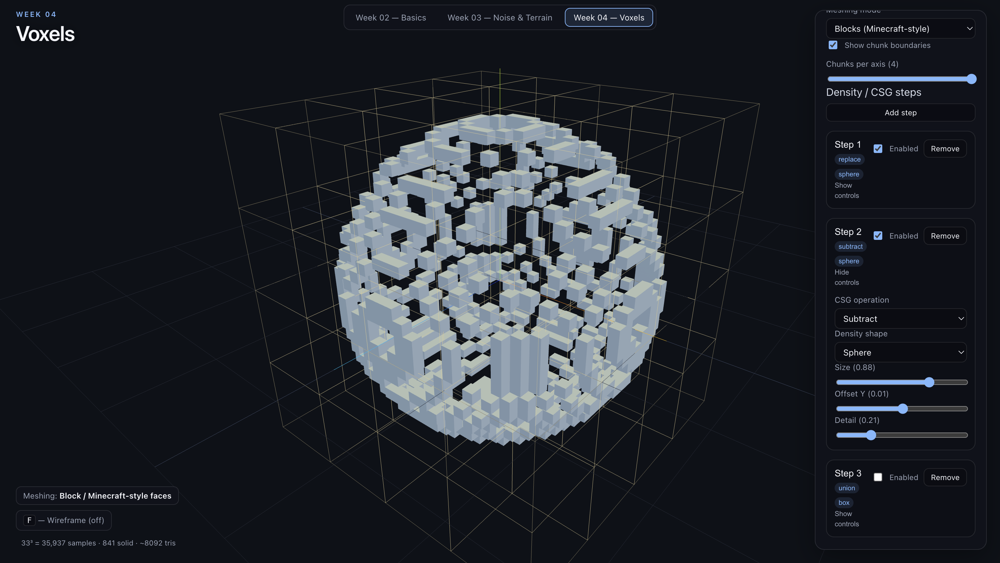

# Procedural World Building

A collection of weekly experiments exploring procedural generation
techniques for world building using React and Three.js.

**Live demo:** [https://erica-procedural-world.web.app](https://erica-procedural-world.web.app)

## Progress

| Week | Topic | Key Concepts | Notes |
|------|-------|--------------|-------|
| 2 | Three.js Basics | scene, geometry, camera, lighting, OrbitControls | [React Setup](docs/tutorials/02-installing-react.md) |
| 3 | Procedural Maps & Terrain | noise, height fields, frequency, amplitude, shaping, layers, hydraulic erosion | [Noise & Terrain](docs/tutorials/03-procedural-noise-and-terrain.md) |
| 4 | Voxels & Firebase | voxels, density fields, CSG, meshing, Auth, Firestore, Hosting | [Voxels](docs/tutorials/04-01-voxels.md) · [Firebase](docs/tutorials/04-02-firebase.md) |

## Selected Experiments


*Week 03 — Noise height field rendered as 3D terrain.*



*Week 04 — Marching Cubes voxel mesh with chunk boundary overlay.*

## Repository Structure

- `app/` — React + Three.js application and weekly exercises
- `docs/tutorials/` — notes explaining procedural techniques
- `docs/planning/` — project planning and feature backlog
- `docs/analysis/` — analysis and experiments
- `docs/images/` — screenshots of weekly work
- `references/` — visual and conceptual references

## Running Locally

```bash
cd app
npm install
npm run dev
```
