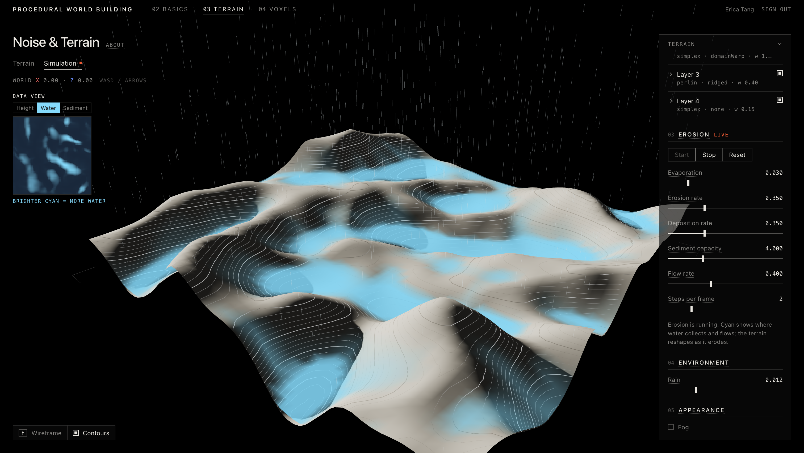

# Procedural World Building

A study notebook for a semester of procedural world building in the browser: weekly exercises in Three.js, noise, voxels and shaders, leading into one main project, **Shadow Ecology**.

**Live Demo:** [procedural-world-lab.web.app](https://procedural-world-lab.web.app)

## Contents

- [Weekly Exercises](#weekly-exercises)
  - [Selected Studies](#selected-studies)
- [Main Project — Shadow Ecology](#main-project--shadow-ecology)
- [Repository Structure](#repository-structure)
- [Running Locally](#running-locally)

---

## Weekly Exercises

One page per week in the app, and one tutorial per week in [`docs/tutorials/`](docs/tutorials/).

| Week | Topic | Key concepts | Notes |
| --- | --- | --- | --- |
| 02 | Three.js Basics | Node, Vite and React setup · scene, camera, geometry, material, light · orbit controls | [Install and Run React](docs/tutorials/02-installing-react.md) |
| 03 | Procedural Terrain | Value, Perlin, simplex and cellular noise · octaves · ridged, billow, terracing and domain-warp shaping · heightmaps · hydraulic erosion and water | [Noise and Terrain](docs/tutorials/03-procedural-noise-and-terrain.md) |
| 04 | Voxels & Firebase | Density fields · CSG (union, subtract, intersect) · Blocks vs Marching Cubes · chunks · Google sign-in, Firestore snapshots, Hosting | [Voxels](docs/tutorials/04-01-voxels.md) · [Firebase](docs/tutorials/04-02-firebase.md) |
| 05 | Shaders | Vertex and fragment stages · uniforms, attributes and varyings · fields and terms on three specimens · displacement | [Shaders](docs/tutorials/05-shaders.md) |

Before Week 02: [Git and GitHub for Beginners](docs/tutorials/01-git-and-github.md) (Week 01). New notes start from the [tutorial template](docs/tutorials/_template.md).

### Selected Studies

| Week 03 — Erosion | Week 04 — Voxels | Week 05 — Shaders |
| --- | --- | --- |
| [](docs/tutorials/03-procedural-noise-and-terrain.md) | [](docs/tutorials/04-01-voxels.md) | [](docs/tutorials/05-shaders.md) |
| Rain carves the heightmap; water settles where it drains. | A ruin assembled from density fields and CSG steps. | A vertex shader pushes the surface along noise. |

---

## Main Project — Shadow Ecology

**Prototype 0.1.** A small world where architecture grows toward the sun, and the shadow it casts slowly becomes habitat.

```text
Light → Growth → Structure → Shadow / Shelter → Habitat
                    ↑
       Weather and time → Weathering
```


**Current systems**

- **Light-driven growth.** Daylight earns a voxel budget, spent on architectural moves (rise, wall, terrace, cantilever, span, opening) that favour sunlit, sun-facing positions. Up to three sites, capped at 7,000 voxels.
- **Accumulated shelter → habitat.** Each day's sunlight is traced through the structure; at sunset the shade is folded into a roughly four-day memory. Habitat is remembered shelter × moisture × footing, so it lags behind the architecture.
- **Weathering.** Driven by weather and time, not sunlight: old, open, high and poorly supported modules wear away, and freed ground reopens to light.
- **Ecology.** Water read from the terrain (lakes, rivers, falls, moisture), vegetation that needs sun rather than shade, and least-cost paths linking sites, water and habitat.
- **Ways of seeing.** The 3D world with material traces, a Field-only view, the Observation plate's top-down Plan, and layer cards with live readouts, all reading the same state.

The simulation is deterministic, with time jumps of 1, 10, 50 and 100 days.


- Concept, rules and known gaps: [Shadow Ecology planning](docs/planning/shadow-ecology.md)
- Visual direction: [Style Guide](STYLE-GUIDE.md)
- Code: [`app/src/project/`](app/src/project/)

---

## Repository Structure

```text
app/                   Vite + React + TypeScript + Three.js (React Three Fiber)
  src/weeks/week02–05  Weekly exercise pages
  src/project/         Shadow Ecology prototype
  src/shared/          Noise, shaders, snapshot persistence, UI system
docs/
  tutorials/           Weekly study notes (Week 01–05) and template
  analysis/            Experiments, observations and critique
  planning/            Shadow Ecology plan and early backlog
  images/              Screenshots per week and for the project
STYLE-GUIDE.md         Visual language for the lab
firebase.json          Hosting (target: lab) and Firestore config
firestore.rules        Per-user snapshot rules
```

## Running Locally

```bash
cd app
npm install
npm run dev
```

Open the URL Vite prints (usually `http://localhost:5173`). Signing in and Save / Load snapshots need Firebase keys in `app/.env.local`; copy `app/.env.example` and see [Firebase](docs/tutorials/04-02-firebase.md). Everything else works without them.
