# Week 05 — Shader Studies: Analysis

> What ten shader rules revealed across three specimens: experiments, limits, decisions. The how-to is in the [Week 05 tutorial](../tutorials/05-shaders.md).
>
> **Observed**: seen in the app or documented in the tutorial. **Predicted**: derived from the code, not yet verified in the browser.

## 0. The shape of a study

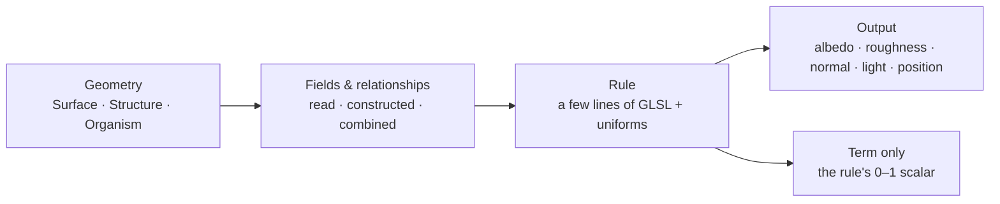

A study is not a field. It is a rule that **reads**, **constructs** or **combines** fields and relationships:

| A study… | Examples | Source |
|---|---|---|
| reads what the geometry carries | Height, Slope | world `y`, world normal |
| constructs a relationship | Distance, Fresnel, Contact | to a probe, to the camera, to the floor |
| reads a field precomputed on the CPU | Growth, Exposure | `aGrowthAge`, `aConvexity` |
| combines several | Surface Material, Exposure, Habitat | noise → 3 channels · sky + convexity · shadow + slope |

## 1. Same rule, different geometry

All specimens stand on y = 0 at exactly 1.60 tall, and slider values persist across geometry switches. **Decision:** any difference in the result comes from the form, not the settings.

| Rule (Observed) | Surface (heightfield) | Structure (box SDFs) | Organism (blended limbs) |
|---|---|---|---|
| Height | Topographic ramp; contours crowd on flanks | Bands: one colour per terrace, gradient only on walls | — |
| Slope | Grades continuously | Nearly binary: tops stone, walls amber | Almost all amber |
| Habitat | Pools on the shaded apron | Sharp patches on shaded terraces | Thin strips on top of shaded limbs |
| Exposure | Ridges white, gullies black (Term view) | Needs convexity: sky facing alone paints every terrace the same | — |

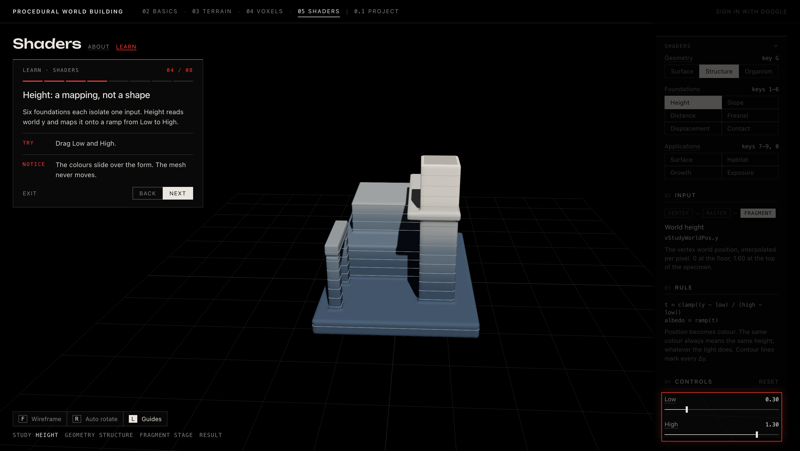

> **Why it matters.** A rule is half of the result; the geometry is the other half. The geometry selector became the main instrument of the exercise.

## 2. Surface Material: one noise field, three channels

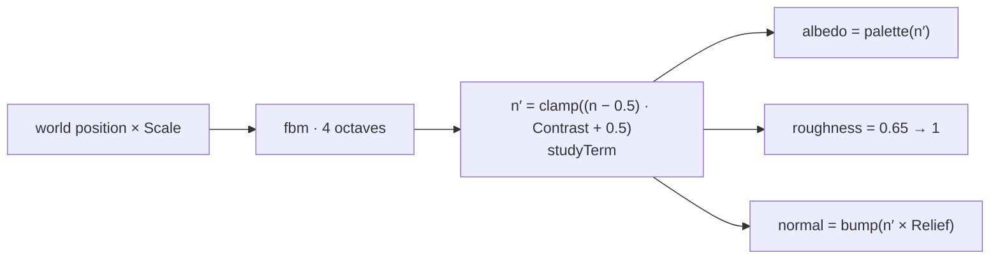

| | Scale | Contrast | Relief |
|---|---|---|---|
| Acts on | Noise frequency | The field `n′` itself | Bump height only |
| Albedo / roughness | Pattern size | Split into two materials | Unchanged |
| Normal | Yes | Yes: steeper `n′` gives a steeper bump | Yes |
| Term only view | Changes | Changes | **Unchanged** |

> **Why Contrast and Relief look alike.** Both strengthen the vein boundaries. Contrast does it *in the field*, which also steepens the bump. Relief does it *in the light*, so its effect depends on the light direction.
>
> **Predicted.** At high Contrast, `n′` clamps into flat plateaus, so the relief collapses onto the boundaries.
>
> **To tell them apart,** switch to Term only: it follows Contrast and ignores Relief.

## 3. Relief vs Displacement

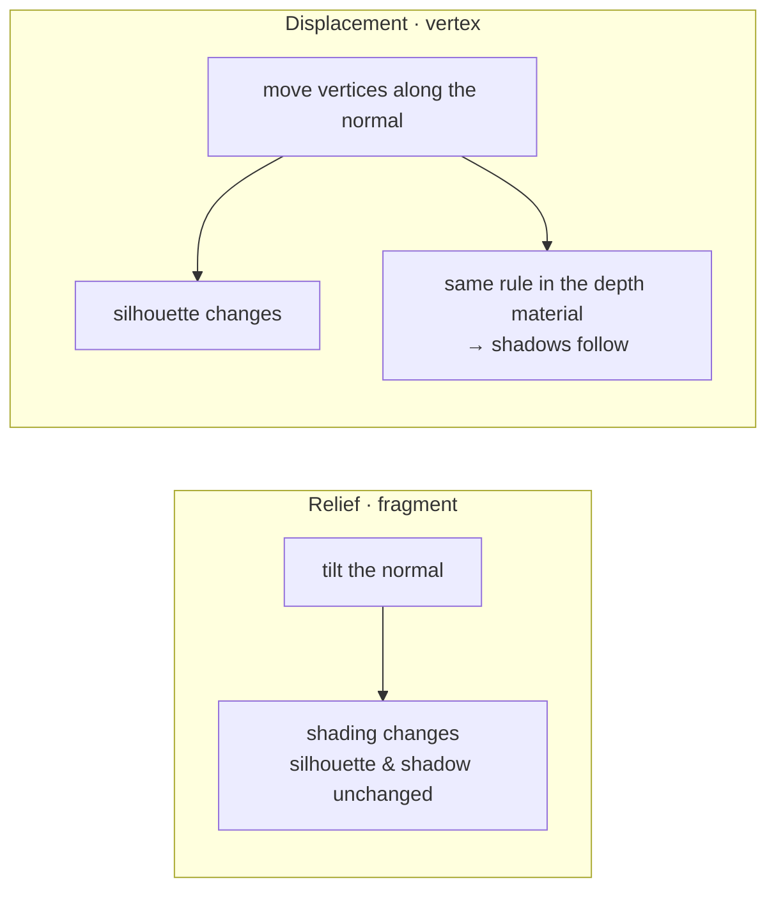

| | Relief | Displacement |
|---|---|---|
| Gives | Apparent depth | Actual form change |
| Limited by | Pixels | Mesh density (bumps alias past it) |
| Precomputed fields | Stay valid | Go stale: age, convexity and footprint describe the undisplaced mesh |
| Seen by the CPU | — | Never: the change exists only on the GPU, per frame |

| Experiment | Observation | Interpretation / decision |
|---|---|---|
| Structure planned as merged boxes | Displacing along normals would split every hard edge | Box SDF union meshed by surface nets: one welded mesh |
| Displacement on Structure, Speed 0 | Outline bumps; self-shadows follow; aliasing where frequency outruns vertices | Relief for fine detail (Exposure pits are a 0.012 bump); displacement kept to show form change |

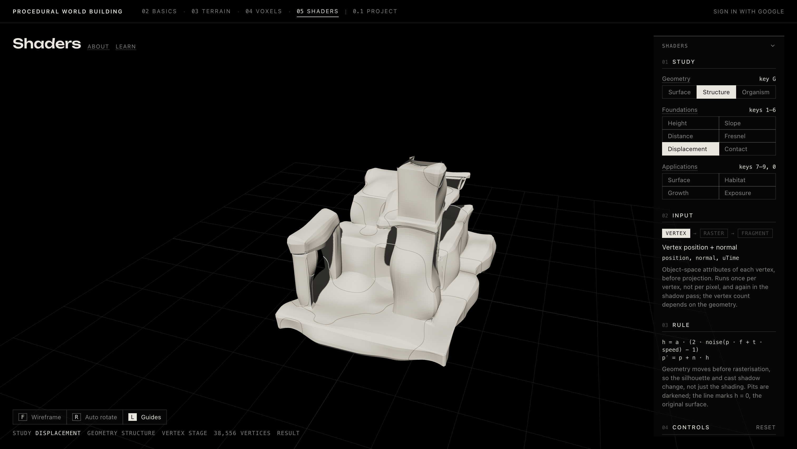

## 4. Contact: two gaps, one rule

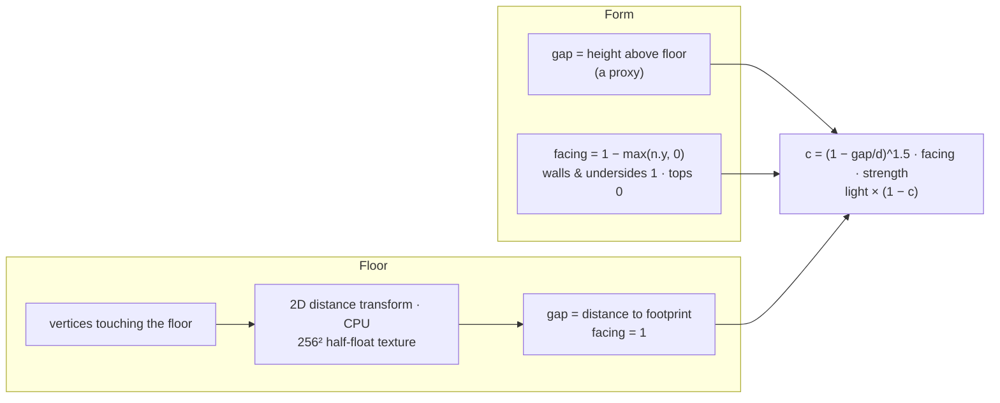

| Experiment | Observation | Fix |
|---|---|---|
| Contact on Surface | Jagged sawtooth ring instead of a soft moat | Floor plate moved below y = 0 (depth fight); texture 8-bit → half-float; gap range raised past the slider max to 1.25 |
| Pale circular floor | Read as a spotlight | Dark graphite ground fading into black |
| Height-only gap on the form | Term view: Structure's whole plinth top evenly grey; Surface's entire low apron dark. It read as unexplained shadow | Weighted by `facing`: tops face away from the floor, so they no longer darken; walls meeting the floor keep the band |

| | Where |
|---|---|
| **Works** (Observed) | Plinth walls where they meet the floor; roots and trunk foot. On Surface only the floor moat remains, because the skin eases onto the floor without a crease |
| **Breaks: false contact** (Predicted) | Walls rising from a low shelf are measured against the floor, not the shelf. Structure's terrace and tower bases, 0.16 above the floor, still get about 40% darkening at the defaults: right place, wrong reason |
| **Breaks: missed contact** (Predicted) | Close surfaces high above the floor: cantilever over the upper terrace (gap about 0.14), inner corners, Organism's fork crotches. Upward faces never darken, even inside a real crease. Floor under an overhang that doesn't touch down |

> **Why it's not ambient occlusion.** True AO asks how much of the surrounding hemisphere *any* geometry blocks. Contact asks one question about one known surface. It is legible and cheap, but its dark regions are not shelter.

## 5. Growth: order of arrival, replayed

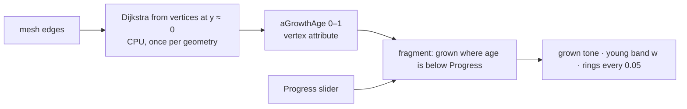

> **Progress is a threshold, not a state.** Scrubbing replays the front instantly in either direction. Nothing is stored or advanced; the history is already in the attribute. Dijkstra measures distance *along the surface*, so the front climbs corners instead of jumping gaps.

| Specimen | Floor contact | The same field reads as… |
|---|---|---|
| Organism (Observed) | Roots and trunk foot | **Growth**: up the trunk, limbs last |
| Structure (Predicted) | The whole plinth base | **Construction**: storey by storey; the cantilever and lintel are reached only through their supports |
| Surface (Predicted) | Essentially the rim | **Spreading**: closing inward and upward like colonisation |

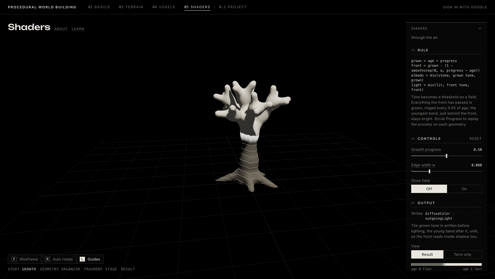

## 6. Exposure: openness becomes wear

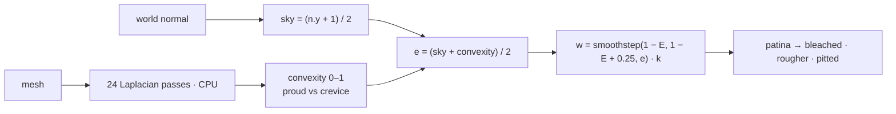

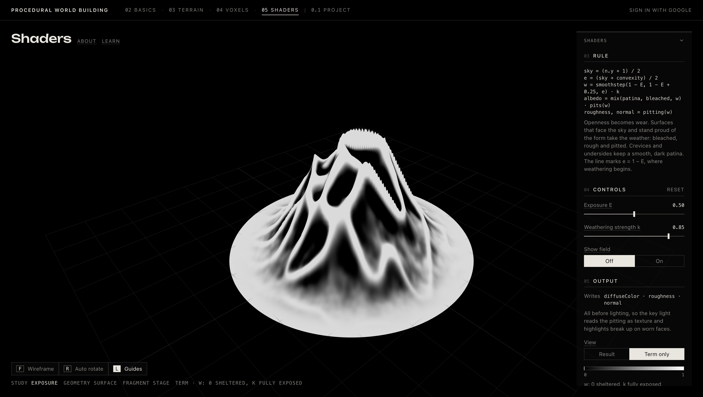

| Limit | Consequence |
|---|---|
| No visibility test | A roofed surface facing the sky scores as open. **Predicted:** the upper terrace under the cantilever weathers at the defaults |
| Convexity is relative | Normalised per specimen by its 95th percentile, and smoothed at one fixed scale, so values don't compare across specimens |
| Weathering is hypothetical | E is how harsh the environment *would be*, not elapsed time. Nothing accumulates; the same E always gives the same wear |

## 7. Habitat: shelter × footing, right now

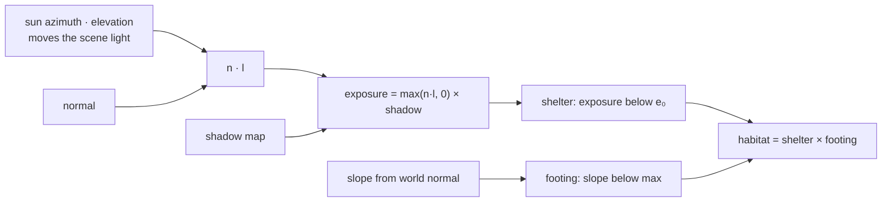

- **Observed:** habitat appears only where shade and holdable ground overlap. Shaded walls fail footing; sunlit terraces fail shelter. Moving the sun migrates it instantly.
- **Predicted:** faces turned away from the sun count as sheltered without any cast shadow, because `n · l` is 0 there. Ambient light plays no part.

### Instantaneous vs remembered

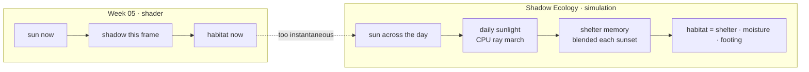

| | Week 05 Habitat | Shadow Ecology habitat |
|---|---|---|
| Computed | Fragment shader, every frame | CPU simulation, each sunset |
| Time | One sun position | Days of sunlight (≈ 4-day memory) |
| Shader's role | *Is* the rule | *Draws* a field that already exists |

> **Why.** A fragment shader only knows this frame, so shade that lasts an hour looks as habitable as shade that lasts all day. The planning doc records the same shift: "temporary shadow defines temporary habitat" proved too instantaneous. See [Shadow Ecology planning](../planning/shadow-ecology.md).

## Takeaways

- **Fields vs outputs.** Each study turns fields and relationships into an output. Term only separates the two, and was the best reading and debugging tool.
- **Approximation as an instrument.** The partial models failed in informative ways. Contact's height proxy showed what enclosure needs; the roofed terrace showed that exposure needs visibility; instant habitat showed that ecology needs time.
- **Visualization vs simulation.** Nothing in Week 05 evolves. Each frame is a pure function of geometry, attributes, uniforms, light and camera. Progress, E and the sun are inputs, not state.
- **For the main project:**
  - Compute anything that needs history in the simulation (shelter, habitat, weathering), and let shaders display it.
  - Keep "time as a threshold on a stored value" for material traces.
  - Keep one noise field driving several material channels.
  - Keep analysis linework switchable without changing the world.
