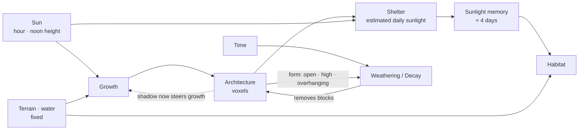
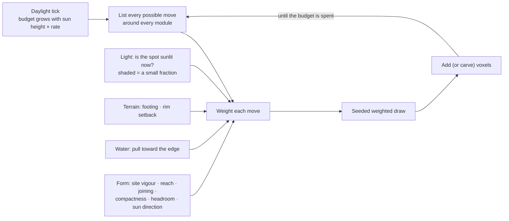
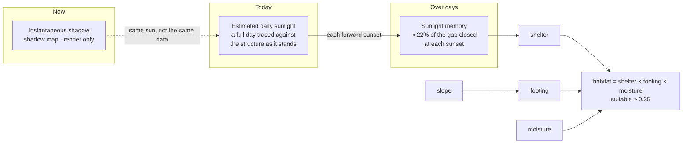
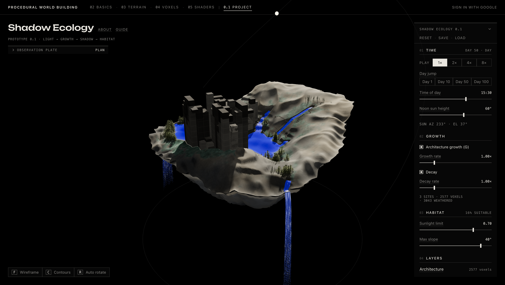
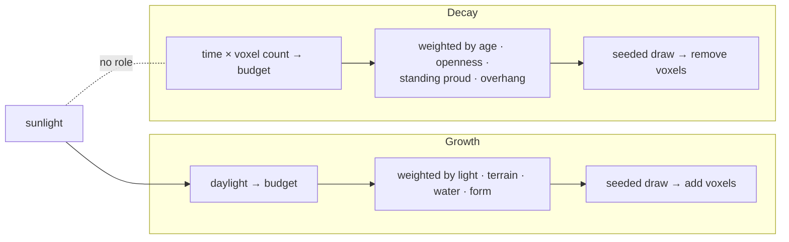
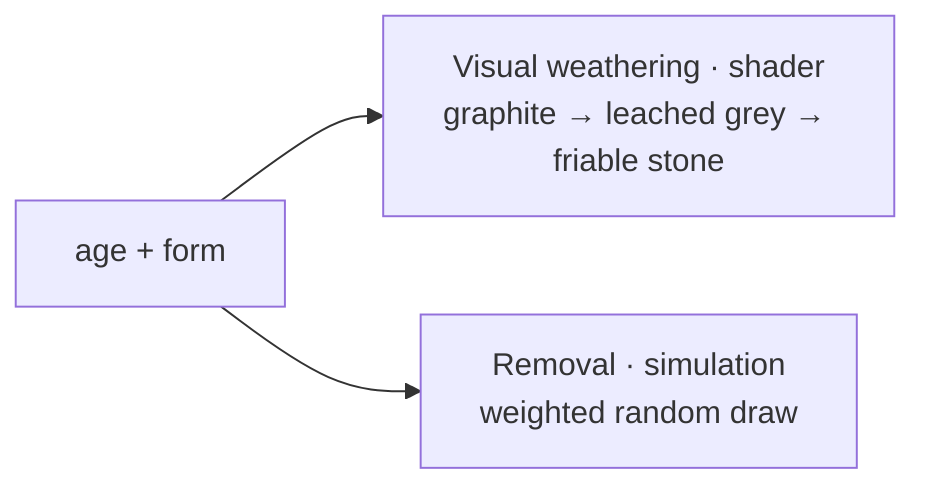
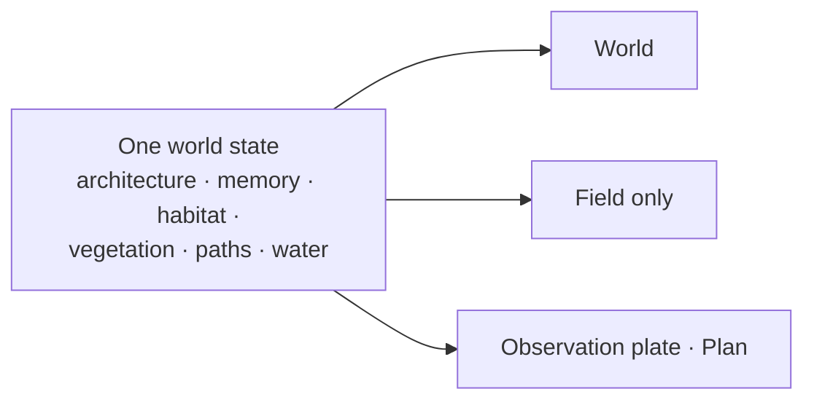
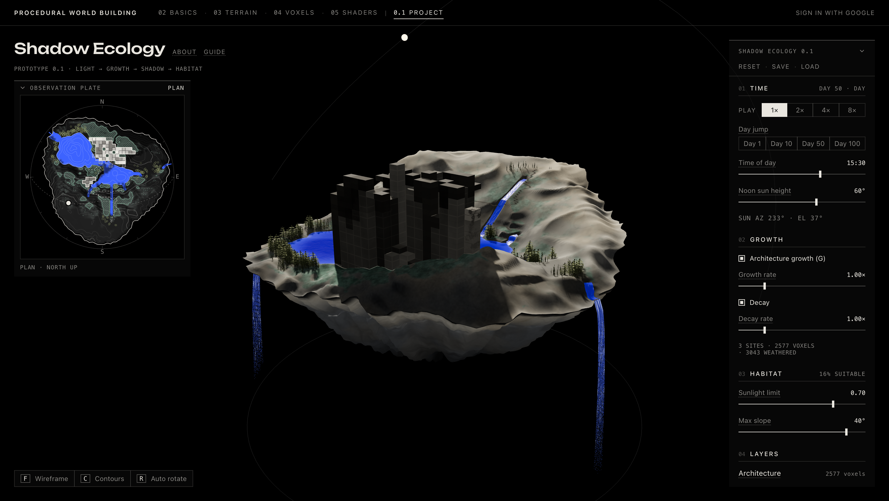

# Shadow Ecology 01 — Analysis

> What the first prototype of the Shadow Ecology system does, and what running it reveals so far. The intent is in [Shadow Ecology planning](../planning/shadow-ecology.md); the Week 05 counterpart is [Shader Studies](05-shader-studies.md).
>
> **Observed**: seen in the app. **Code-derived**: follows from the implementation, not yet verified in the browser.

## 1. System at a glance

Only two things carry the past forward. Everything else is fixed or rebuilt:

| Kind | What |
|---|---|
| **Fixed** at load | Terrain, lakes, rivers, falls, moisture, where building is possible |
| **Evolving state** | Architecture (with each block's birth time) · sunlight memory |
| **Rebuilt from state** | Daily sunlight, habitat, vegetation, paths |
| **Drawn only** | Shadow on screen, block wear, lichen, Field emphasis, contours, the plan |

## 2. Light → Growth

| Move | Favoured when (Code-derived) |
|---|---|
| Rise | Sun is high; row neighbours rise together; ground is firm and away from the rim |
| Wall | Face runs broadside to the sun; near water; firm ground |
| Terrace | Steps down toward the sun; near water |
| Cantilever | Faces the sun; ignores footing, rim and water, so it can reach over them |
| Span | Bridges to an equally high module; strongly favoured when joining two sites |
| Opening · cut | Tall walls and enclosed cores; these remove voxels |

> **Two roles of light.** Daylight sets *how much* grows; the sun's direction and sunlit spots set *where* and *which way*. Shade suppresses a move but never forbids it.
>
> **Deterministic, not scripted.** Terrain, water and sites have no randomness; growth and decay draw from one seeded stream. The same actions from Reset replay the same world (Code-derived).

## 3. Structure → Shelter → Habitat

| Control | Means |
|---|---|
| Sunlight limit | Remembered sunlight at which shelter is half gone; full below half of it, none above 1.5× |
| Max slope | Footing fades from half this angle and is gone at it |

> **What shelter is not.** The shadow you see is never stored. Habitat reads the *memory* of estimated full days, so passing shade counts little and lasting shade counts most. Changing the rule re-reads the memory instantly; changing the structure or sun only arrives over sunsets.

## 4. Change over time

| Experiment | Observation (Observed) | Interpretation (Code-derived) |
|---|---|---|
| Play, or Day Jump to 50, with growth and decay on | **Architecture grows substantially** | Every daylight hour adds to the budget; decay is far slower, and growth only stops at the voxel cap |
| Watch habitat across days | **Habitat changes spatially** | New masses move the estimated daily sunlight; the memory drifts toward it, so habitat migrates with a lag of days. Ground under a new footprint is lost immediately |
| Watch vegetation and paths across the same days | **Comparatively stable** | Neither has memory. They look stable because their inputs barely move: fixed moisture, slope and water, sites that never relocate, and sunlit ground that sits mostly away from the architecture |

> **Stable ≠ persistent.** Vegetation and paths are rebuilt from scratch at sunset and after settings settle. Their steadiness says something about their inputs, not about accumulated history.

## 5. Habitat vs vegetation

| | Habitat | Vegetation |
|---|---|---|
| Wants | **Accumulated shelter** on gentle, moist ground | **Current sunlight** on moist, gentler ground |
| Reads | Sunlight memory (≈ 4 days) | Today's estimated sunlight only |
| Memory | Yes, through sunlight memory | None: rebuilt from current state |
| Overlap | Possible: partly shaded, moist ground can suit both | Possible: it reads today, habitat reads days |
| Why it looks the way it does | Changes as shade from growth accumulates (Observed) | Looks stable (Observed): its inputs are mostly fixed, and new shade falls mainly on ground it already avoids (Code-derived) |

## 6. Growth vs weathering / decay

| | Growth | Decay |
|---|---|---|
| Runs | Daylight ticks only | Every tick, day and night |
| Sunlight | Sets amount and direction | **None.** Only indirect: sun shaped the form and set the block ages |
| Acts on | Around every module | Slabs fall; masses wear 2 layers at a time down to a plinth; bare plinths clear |
| Speed | Fast | Far slower |

> **The look is a forecast, not a trigger.** Visual wear and removal read the same age and form, but separately. A worn block is *likely* to go next, not scheduled to; a young block can still go. The material also pales faces turned to the noon sun and bleaches sunlit texels, which is drawing only and can read as sun-driven weathering.

## 7. Ways of seeing

| View | Reveals | Recedes |
|---|---|---|
| World | Everything as material: masses and their wear, cast shadow, lichen, plants, worn paths, water | Exact boundaries |
| Field only | Habitat as notation: hatching, the suitable edge, what the last sunset gained and lost | Paths and plants hidden; other ground dimmed |
| Plan (north up) | Footprints by height, water, habitat notation, plants, routes, shade now, the sun on a horizon ring | Section and vertical form |
| Contours | Elevation lines, and depth lines on lakes | Under dense lichen |

> **Same state, different questions.** None of these views computes new data. They choose which part of the state to make legible.

## 8. Works / breaks / what this suggests

| | |
|---|---|
| **Works** (Observed) | The chain produces visible change: architecture accumulates, and habitat migrates as it does |
| **Works** (Code-derived) | Memory separates lasting shade from passing shade. Decay turns form over instead of letting it grow forever. Runs replay from a seed |
| **Approximation** | Daily sunlight is an estimate for a full ideal day against the structure at sunset, not the light that actually fell. The plan's shade is a CPU trace, not the rendered shadow |
| **Limitation** | Vegetation and paths have no history, and paths never wear in. Water never responds to architecture. Sites are fixed at Reset. Nothing downstream, whether habitat, plants or paths, feeds back into growth |
| **Limitation** | Scrubbing time backward still grows and decays without counting days or memory. Day 1 habitat starts as if the seed blocks had always stood |
| **Suggests** | To make vegetation and paths *record* time, they need their own memory (establishment, wear). Stability should then become evidence rather than a side effect of fixed inputs |

## Takeaways

- **Week 05 asked:** *what information can a surface reveal?* Each study turned fields into an output, every frame, with no past.
- **The Project asks:** *what information can a world reveal about the processes that formed it?* Here the reading depends on history: masses record sunlit growth, habitat records days of shade, wear records age and exposure.
- **What reveals process today:** the architecture and the habitat, the two systems with state or memory. Vegetation and paths show *current conditions*, not formation.
- **Instantaneous vs accumulated** is the key distinction: the shadow on screen, today's estimate and the remembered sunlight are three different things, and only the last shapes habitat.
- **Visualization vs simulation.** As in Week 05, shaders draw; but here they draw fields the simulation has already accumulated. Where the drawing implies more (sun-bleached blocks, "worn" paths), it runs ahead of the model.
