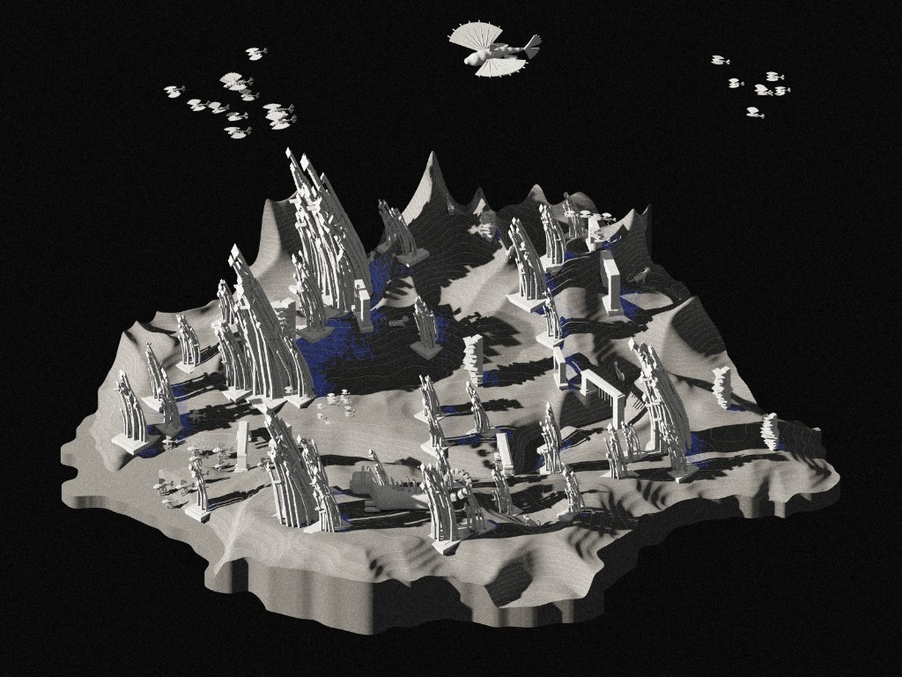

# Shadow Ecology — Visual Direction

> What could the world look and feel like? Exploratory imagery, morphology, references and research.
> Related: [Shadow Ecology planning](shadow-ecology.md) (concept, systems, Prototype 0.1) · [Style Guide](../../STYLE-GUIDE.md) (execution and design-system rules)

---

## Direction

**The world blurs architecture, organism, geology and scientific model.** Organisms should feel derived from the same procedural, formal language as the landscape and structures, not like conventional animals placed into the scene.

> **Exploratory, not implemented.** Visual and concept research for future development. Nothing here is committed Prototype 0.1 functionality. How organisms take part in the ecology is a system question, kept under [Organisms](shadow-ecology.md#organisms) in the planning document.

## Concept Visuals

> **Concept visualization, not a screenshot.** A visual reference for the world's direction, not the current Prototype 0.1 implementation.

## Visual & World Vocabulary

**Form / motifs**\
circle · ring · ripple · shell · eye · bubble · river · branching · cross-section · layers · abstract geometry · maps · contour lines

**Material / landscape**\
stone · moss · water · river · wind

**Optical / representational**\
fisheye · telescope · scientific specimen · cross-section · black and white with restrained colour · analytical / cartographic overlays

**Organic references**\
fish / marine organisms · cat · bird · horse

## Creature Explorations

Drawn from the concept visualization above. Directions, not fixed species. Cat, fish, bird and horse are sources of form, movement, behaviour and morphology, not literal species that must appear in the world.

| Direction | Hybrid of | Form and behaviour |
|---|---|---|
| **Light-fin creatures** | fish × bird | Fan-like radial fins or wings; airborne, oriented or migrating toward light |
| **Small perching light-fins** | light-fin variant | Rest on structural growths |
| **Stilt creatures** | fish × quadruped / cat | Elongated legs; aquatic body language translated onto land |
| **Shadow creatures** | cat × mineral | Faceted, prismatic bodies, segmented geometric tails, crystalline plates; associated with sheltered habitat |
| **Architecture-creature hybrids** | organism × structure | Larger organisms that host or grow structural forms on their bodies |

## Visual Research Keywords

Search terms for Are.na while developing the conceptual and visual direction.

| Theme | Search terms |
|---|---|
| **Ecology / organisms** | ecosystem engineers architecture animals · organisms building habitats · termite mound ecology architecture · shade adapted ecosystem · cave ecology · biological structures habitat · canopy microclimate |
| **Light / architecture** | self shading architecture · architecture shaped by solar shadow · negative space architecture shadow · light shadow architecture diagram · generative architecture growth |
| **Landscape / time / material** | material weathering architecture · landscape as archive · traces of time architecture · temporal landscape drawing · process drawing architecture |
| **Visual language** | speculative landscape drawing · architectural ecology diagram · geological section illustration · environmental data visualization landscape · scientific specimen visualization |
