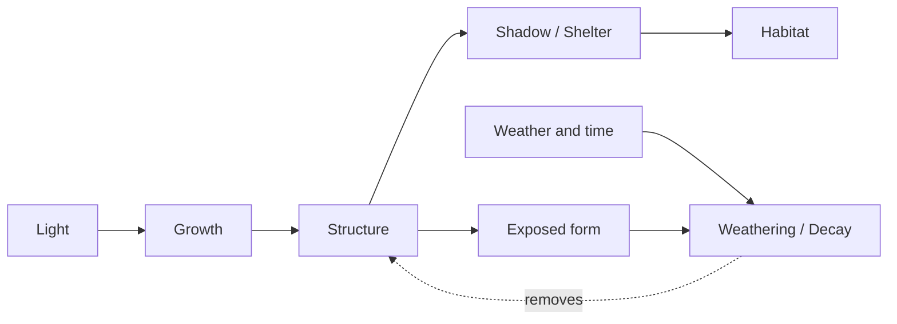
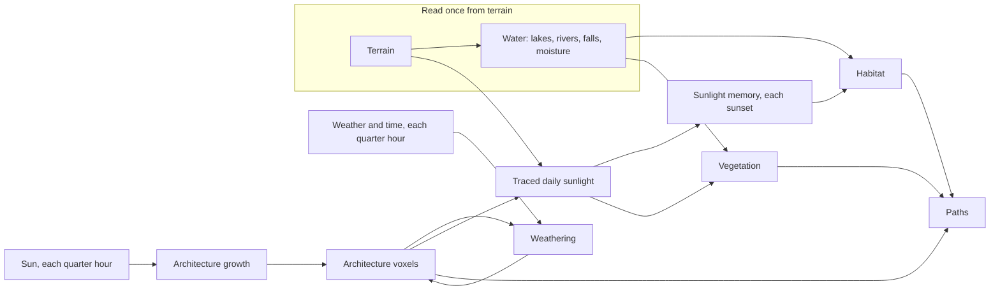

# Shadow Ecology — Planning

> Living document and current source of truth for the concept and the prototype. Working directions, not final decisions.
> Related: [Style Guide](../../STYLE-GUIDE.md) · [Backlog](backlog.md)

| | |
|---|---|
| Status | Prototype 0.1 running: growth, shadow, remembered habitat and weathering are live |
| Code | `app/src/project/` |
| Last updated | 2026-09-29 |

---

## Concept

**Environmental processes leave traces over time.**

A small floating world sits under a moving sun. Nothing in it is placed by hand: every structure, shadow, plant, path and patch of habitat is the trace of a process acting on the world. Once running, the world records what light, growth, weather and time have done to it.

> Light reveals structure. Shadow reveals habitat. (Style Guide)

### The chain

| Step | Meaning |
|---|---|
| **Light** | A moving sun: direction and height change through the day and, as a stand-in for season, from day to day |
| **Growth** | Light pays for new form. Structures extend where and when they are sunlit |
| **Structure** | Accumulated built form: stepped masses, walls, terraces, cantilevers |
| **Shadow / Shelter** | What the structure blocks. Shadow is instant; shelter is shade that persists over days |
| **Habitat** | Ground sheltered, moist and stable enough for shade-dependent life |
| **Exposure → Weathering** | The counter-process: weather and time wear away what stands open, high and unsupported. It reads form, not sunlight |

### Core tension

**Structures seek light, but the shade they create is what enables other life.**

Growth is drawn to the sun, yet every block it adds takes sun from the ground and from the structure itself. Habitat is a by-product of growth that was never meant for it. Too little structure gives no shelter; too much shades out its own growth. Weathering keeps the balance moving: exposed form wears back, freed ground reopens to growth, and the shade shifts with it. The aim is turnover, not a finished state.

### Time as memory

The world's state is its history. What exists now is what has accumulated:
- the architecture: each voxel's age, the simulated time since it was placed
- what has weathered away
- the remembered daily shelter that habitat is built from

The same settings and the same passage of time always give the same world, so time can be replayed as well as watched.

Timescales nest: shadow moves over hours, habitat follows it over days, and architecture grows and turns over across tens of days.

### Many ways of seeing

The ecology is one world state, shown in several representations. Each is a different reading of the same data, never a separate simulation. The 3D world, the plan, the field view and the readouts all read the same state. A new view should reveal a relationship the others hide, not add a new system.

### Concept history

- **Starting premise (early 0.1):** *temporary shadow defines temporary habitat.* The sun moves, so shadow moves, so habitat slides across the world through the day. This proved too instantaneous: shade that lasts an hour is not a place to live. Habitat is now built from **remembered** daytime shelter, so it follows changing shadow over days, not minutes.
- **Earlier directions:** Shadow Ecology came out of four: Living Atlas, Emergent Civilization, Strange Ecology and Inverted Ecology. It keeps these principles:
  - **Inversion with an internal logic:** familiar relationships reversed (architecture adapting to nature, organisms supporting the environment), always with a rule behind them, not just visual strangeness.
  - **Structures have reasons:** location, form and relationships emerge from world conditions (terrain / water / light → sites → growth → paths).
  - **Map ↔ world:** the same systems read as a 2D composition and a 3D world.

---

## Current Implementation (Prototype 0.1)

Prototype 0.1 began as *static architecture + instant habitat*. It now runs the full chain above, plus water, vegetation and paths as supporting systems.

### World (static)

| Part | Implementation |
|---|---|
| **Terrain** | Floating landmass: a ridge, a knoll and a hollow, plus Week 03 noise; an eroded, fractured rim; a layered cliff (soft beds recessed, hard ledges, gullies, a notch under the cap rock); a stepped hanging underside |
| **Water** | Read from the terrain once, not simulated: depressions filled, flow routed downhill and drainage accumulated. Large basins become lakes, well-drained lines become rivers that cut channels, and rivers reaching the rim fall off. Produces a moisture field |
| **Sun** | A stylised day: rises east at 06:00, crosses south at noon, sets west at 18:00. *Noon sun height* (20–85°) stands in for season |

### Running processes

| Process | Rule | When |
|---|---|---|
| **Light field** | Rays marched towards the sun over the ground grid and through the architecture voxels (the same shadows the shadow map draws). Daily sunlight is the sum over 10 samples between sunrise and sunset, relative to open flat ground | At sunset, or when the settings change |
| **Sites** | Up to 3, clustered where the bare terrain is best lit, flattest and just clear of a water edge | At Reset |
| **Growth** | Each quarter hour of daylight earns a voxel budget ∝ sun strength. It is spent on a grammar of module moves (rise, wall, terrace, cantilever, span, opening, cut), each weighted by *sunlit now · facing the sun · form · water edge · site vigour*. Shaded growth is much slower. Capped at 7,000 voxels | Every tick |
| **Weathering** | Weather and time, not sunlight. Budget ∝ standing volume, day and night, far below growth while small. Moves: unloaded slabs fall, modules wear down two layers at a time to a plinth, edge plinths clear. Each is weighted by *age · openness (open sides) · height (standing proud) · poor support (overhang)*. Freed ground reopens to growth | Every tick |
| **Age** | Every tick advances the architecture clock; a voxel's age is the clock time since it was placed (full after 8 days), so blocks keep ageing while growth is paused | Every tick |
| **Habitat** | `remembered shelter · moisture · footing(slope)`. Each sunset the day's sunlight is blended into a memory (≈ 4-day time constant; night never counts as shelter). Excludes water, architecture and the rim | Each sunset |
| **Vegetation** | The opposite of habitat: needs enough daily sun, plus moisture and footing. Plant form (frond, spire, pod, tier) answers moisture, light and vigour | Rebuilt each sunset |
| **Paths** | Least-cost routes (climbing costly, fords cost extra, lakes and architecture impassable). Sites are joined by a spanning tree, with spurs out to water edges and to vegetation and habitat regions. Reused ground gets cheaper, so trunks form | Rebuilt each sunset |

### Time controls

- **Clock:** Play (1–8×) or scrub the time of day. The sun at each tick drives growth, but only forward time counts days and adds to memory.
- **Day jumps (1 / 10 / 50 / 100):** fast-forward tick for tick. A day earlier than the current one replays from Reset.
- **Determinism:** seeded, so the same settings give the same world.
- **Process toggles:** growth and decay each have an on/off toggle and a 0.25–4× rate multiplier. Habitat has *sunlight limit* and *max slope*.

### Ways of seeing (implemented)

| Representation | What it shows |
|---|---|
| **3D world** | Lit specimen on a black field. Shadow is the lighting itself, never a tint. Colour is semantic: neutral for rock and architecture, cobalt for water, warm olive for vegetation, cool lichen green for habitat, stained into the ground as colonies that coalesce into a mottled crust where it turns suitable, with quiet marks for what the last sunset gained (fresh lichen) and lost (a ghost of hatching); Field only adds hatching and the suitable edge. Architecture wears visibly before decay removes it, as material states that read at viewing distance: intact graphite → weathered (leached to a mottled mineral grey, matte, edges chalking) → heavily weathered (pale friable stone eaten into dark pockets, worn relief, wide joints), strongest where decay weighs the form most. The bottom-left view strip (F Wireframe, C Contours, R Auto rotate) is shared with Weeks 03–05. Contours is off by default; on, all analytical linework appears together: elevation contours, lake depth lines, and river and waterfall flow lines |
| **Material traces** | Architecture colour records its history: fresh blocks are graphite; as simulated time passes, open faces pale and sheltered ones sink to charcoal. Terrain darkens where damp and where paths wear |
| **Field only** | Strengthens the habitat field and clears plants and paths, so the pattern reads alone |
| **Observation plate: Plan** | The same live state as a survey sheet, north up: water, footprints, worn routes, current shade, habitat patches with iso lines, vegetation marks, and the sun on a chart ring |
| **Layer cards and readouts** | Each system as inputs → rule → output → now, plus live counts (voxels, sites, weathered, % suitable, routes) |

### Known gaps

Places where the implementation is still simpler than the concept:
- **Weather is implicit.** Weathering is one uniform weather-and-time process read through form (age, openness, height, support). There is no explicit weather yet (no wind direction, rain or moisture term), and light plays no part: light builds, weather and time erode.
- **Paths and vegetation keep no memory.** They are recomputed from the current state each sunset, so they don't yet leave traces: wear does not accumulate and plants don't persist.
- **Habitat is unoccupied.** It marks where life *could* be; nothing lives there yet, and habitat feeds nothing back except path destinations.
- **Only architecture casts shadow in the light field.** Plants don't.
- **Terrain and water are fixed.** Architecture keeps clear of the water, but water never responds to it.
- **Only one projection.** Plan is the only view on the observation plate.

---

## Open Questions / Future Directions

Ordered roughly by how directly each one deepens the chain.

### Growth ↔ shade balance
- Is there a balance point where architecture and habitat coexist, or does the world oscillate? What does the long-run share of habitat look like across noon sun heights?
- Should growth respond to *accumulated* light (a site's history) rather than the sun of the moment?
- Can a structure be *designed* for the shade it casts (architecture adapting to nature)?

### Exposure → Weathering
- Should weather become explicit: a prevailing wind or rain direction that favours faces open toward it, or faster wear near water?
- Should the rock and terrain weather too (Week 03 erosion as a slow force), not just architecture?
- What remains of weathered form? Rubble, scars, ground that remembers a footprint?

### Traces and memory
- Paths as accumulated wear: routes that deepen with use and fade when abandoned.
- Vegetation as persistent state: plants that establish, spread and die back rather than being recomputed.
- One slow clock sampled by faster ones, or nested clocks per process?

### Organisms
- What occupies habitat: individuals, colonies, a continuous field?
- Do organisms follow the shade as it moves over days, or wait for it to return?
- Can life feed back, e.g. organisms supporting structures, or holding moisture?
- What traces does life leave?

### Many ways of seeing
Candidates, each reading the existing state:
- **Section / elevation:** shade and shelter under overhangs, which a plan hides
- **Chronology:** a strip of one place's light, growth and habitat over days, making memory visible
- **Sun-hours map:** daily sunlight itself, the field that both growth and habitat read
- **Ledger / specimen sheet:** the world summarised as counts and records

How do the 3D world and the 2D projections stay one composition rather than two views?

### World systems
Each should emerge from relationships already in the world, not be placed as decoration.

| System | Could emerge from |
|---|---|
| **Weather** | Cloud as a second, moving shadow layer; rain feeding moisture |
| **Seasons** | Noon sun height cycling over time instead of being a slider |
| **Dynamic water** | Shade holding moisture; runoff re-routed by structures |

### Interaction
- What can the user influence: sun, structures, rules, or nothing (observation only)?

---

## Procedural Works to Study

Study these for specific procedural ideas, not for what the world should look like. For each, ask what is actually procedural: form, appearance, distribution, behavior, structure, time or world logic. A world does not need to proceduralize all of these.

| Reference | Relevant to | Why |
|---|---|---|
| **Cloud Gardens** | Architecture growth, vegetation | Organic growth responds to human-made structures and gradually transforms a scene |
| **Townscaper** | Architecture | A small set of placement rules becomes a recognisable visual language |
| **Wave Function Collapse** | Architecture, structures | Adjacency constraints generate complex architecture, maps and patterns |
| **Town to City / settlement systems** | Structures reshape habitat | Local placement rules accumulate into larger patterns instead of designing each building |
| **Physarum / slime mold** | Paths | Agents following local rules form road-, vein- and root-like networks |
| **Reaction-diffusion** | Growth, weathering | Local interactions produce coral-, cell- and rock-like surface patterns |
| **Lenia / cellular automata** | Organisms | Simple mathematical rules generate life-like moving forms |
| **Bad North** | Terrain | Constrained variation keeps small generated islands readable and coherent |
| **Monument Valley** | Materials, light | Simple geometry made distinctive through colour, fog and surface direction |
| **Proteus** | Multiple timescales | Colour, vegetation and seasonal change combine into a sense of place |
