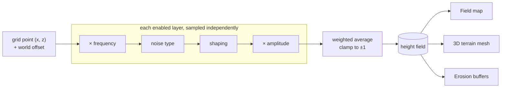
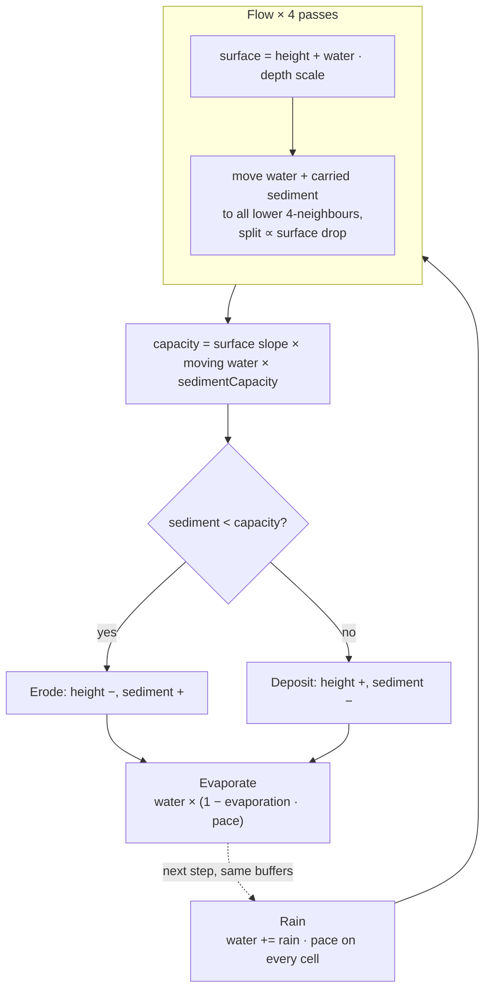
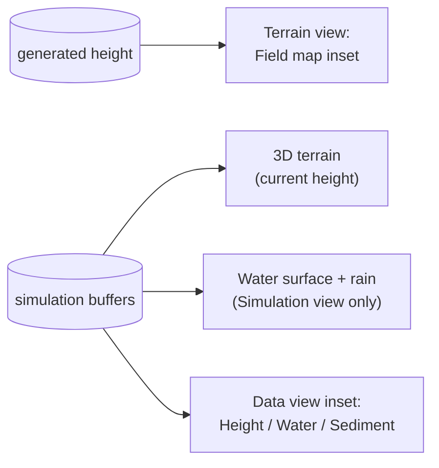
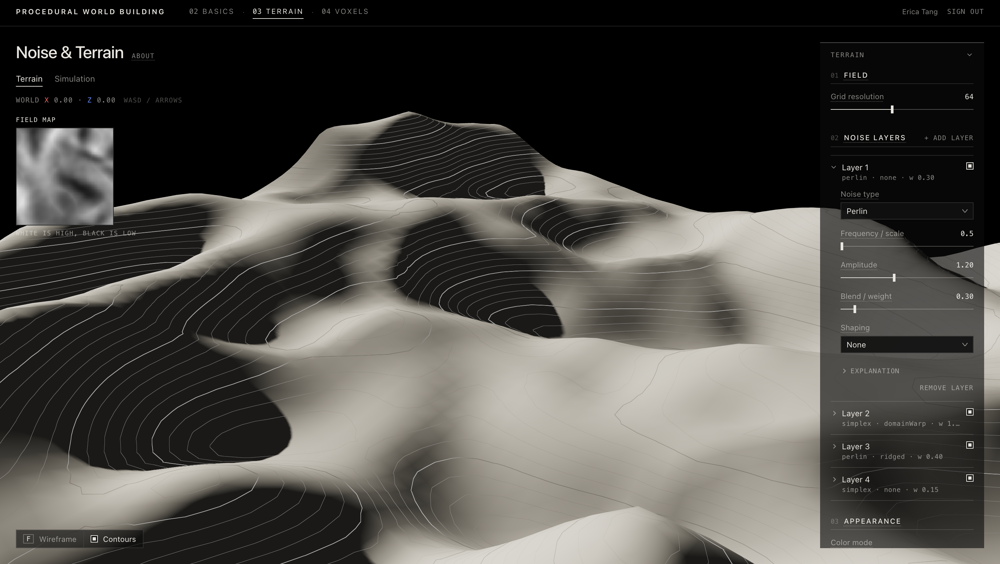
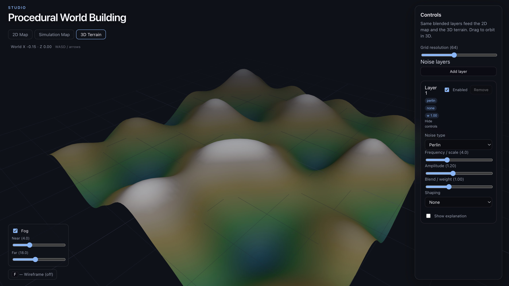

# Week 03 — Procedural Noise and Terrain

> Weighted layers of shaped noise build one height field that drives a 2D field map and a 3D terrain, and a stateful hydraulic-erosion simulation then rains on, drains and slowly reshapes that terrain.

---

## Why It Matters

- **Terrain from rules, not sculpting:** a few parameters describe an unbounded landscape; WASD scrolls the same rules to new ground.
- **One field, many readers:** the height field is plain data, so the same array feeds a map, a mesh and a simulation. Later systems (biomes, voxels, placement) can read it the same way.
- **Generation vs. process:** noise produces a *plausible* initial shape; erosion adds *history*: water paths, valleys and deposits that come from a process running over time, not from a formula.

---

## Core Concepts

| Concept | Meaning |
|---|---|
| **Noise** | Function `(x, y) → [-1, 1]` whose nearby samples are related: smooth structure, not static. Types: Perlin, Simplex, Value, Cellular/Worley. |
| **Frequency** | Noise cells across the map window. Low = broad landforms, high = fine texture. |
| **Shaping** | Per-layer transform of the sampled noise (ridged, billow, terracing, domain warp…). Changes character, not the source. |
| **Layer** | One noise type + frequency + shaping + amplitude + weight, with an enable toggle. |
| **Height field** | `resolution × resolution` `Float32Array` in `[-1, 1]`. The shared data structure. |
| **Field map** | Grayscale inset of the generated height field (white high, black low). |
| **Simulation state** | Three buffers on the same grid (**height**, **water**, **sediment**) that persist and change every step. |
| **Capacity** | How much sediment moving water can carry; the gap between capacity and carried sediment decides erosion vs. deposition. |

---

## How It Works

### 1. Noise → shaping → weighted layers → height field



Every enabled layer samples the **same** point, shapes it, scales it, and the results are averaged by weight:

$$h = \mathrm{clamp}\left(\frac{\sum_i w_i \, a_i \, \mathrm{shape}_i(\mathrm{noise}_i(f_i x,\ f_i z))}{\sum_i w_i},\ -1,\ 1\right)$$

- **Amplitude** scales a layer's values; **weight** sets its share of the average. Because the sum is divided by total weight, adding a layer dilutes all the others.
- **Why layer order doesn't matter (currently):** no layer reads another layer's output, and a weighted sum is commutative, so reordering the list gives an identical height field. Order would only matter with sequential operations: masks (ridges only on high ground), blend modes (multiply, max), or one layer warping the next.

| Shaping | Formula (`n` = sampled noise) | Character |
|---|---|---|
| None | `n` | Raw noise |
| Ridged | `(1 − abs(n))² · 2 − 1` | Sharp crests along zero-crossings |
| Billow | `abs(n) · 2 − 1` | Rounded mounds, V-shaped creases |
| Turbulence | `Σ abs(n(2ᵏx)) · 0.5ᵏ`, normalised | Crumpled multi-scale roughness (param: octaves) |
| Terracing | `floor(((n+1)/2) · steps) / steps`, rescaled to ±1 | Stepped bands (param: steps) |
| Power | `sign(n) · abs(n)ᵖ` | Sharper peaks (p > 1) or fuller mids (p < 1) |
| Domain warp | `n(x + s·n(x,y), y + s·n(x+5.2, y+1.3))` | Sinuous, twisted forms (param: strength) |

### 2. Hydraulic erosion: a stateful process

The generated field is copied into the simulation's **height** buffer; **water** and **sediment** start at zero. Each animation frame runs `stepsPerFrame` steps, and every step mutates the three buffers in place:



- **Flow by water surface**, not bare terrain, so depressions fill into level pools and overflow into the next basin; splitting across all lower neighbours joins trickles into streams.
- **Capacity depends on moving water** (this step's outflow), so still pools carry little and deposit, while fast water on slopes erodes.
- **Edges drain:** off-grid neighbours extrapolate the terrain slope outward, so water leaves where the land slopes off the map.
- **Separate clocks:** water runs 4 flow passes per step at a shared `WATER_PACE`, while terrain change is scaled by a tiny `TERRAIN_RATE`, so water settles in seconds and the landform stays recognisable.

### 3. Views of the same data



| View | Shows | Scale |
|---|---|---|
| **Terrain** | 3D mesh + **Field map** of the *generated* height field | Grayscale, fixed `[-1, 1]` |
| **Simulation → 3D** | Same mesh from the simulation height, plus a cyan water surface at `height + depth` and rain streaks while running | Water alpha on a log scale of depth: thin films invisible, streams faint, pools solid |
| **Data view: Height** | Current (eroded) height buffer | Grayscale, fixed `[-1, 1]` |
| **Data view: Water / Sediment** | Water or sediment amount per cell | Cyan / sand, **normalised to the current maximum**: relative, not absolute |



*Terrain view: the Field map (top left) is the same generated height field as the 3D mesh, read as an image.*


*Simulation view after about 12 s: rain falls, water collects in the valleys and basins, and the Water data view shows the same buffer as a map (brighter cyan = more water, relative to the current maximum).*

---

## Implementation

### Key Files

| File | Role |
|---|---|
| `app/src/shared/noise/types.ts` | Layer/settings types, default layers, dropdown options |
| `app/src/shared/noise/perlin.ts`, `simplex.ts`, `value.ts`, `cellular.ts`, `sample.ts` | Base noise functions; `sampleNoise` dispatches by type |
| `app/src/shared/noise/shaping.ts` | Shaping operations and their parameter labels/ranges |
| `app/src/shared/noise/generateHeightmap.ts` | Per-layer sampling, weighted combine, height-field generation |
| `app/src/weeks/week03/hydraulicErosion.ts` | `stepHydraulicErosion`: rain → flow → erode/deposit → evaporate |
| `app/src/weeks/week03/NoiseTerrainWeek.tsx` | Page: settings state, world offset (WASD), simulation buffers and animation loop, view switching |
| `app/src/weeks/week03/TerrainCanvas.tsx` | 3D scene (light, shadow, overlays) |
| `app/src/weeks/week03/TerrainPanels.tsx`, `terrainConfig.ts` | Environment and Appearance panel sections, fog defaults |
| `app/src/weeks/week03/NoiseExercise.tsx` | Terrain mesh: height field → plane vertices |
| `app/src/weeks/week03/terrainContours.ts` | Shader patch: contour lines and Elevation colour mode |
| `app/src/weeks/week03/WaterSurface.tsx`, `RainStreaks.tsx` | Render-only water surface and rain from the simulation buffers |
| `app/src/weeks/week03/AppChrome.tsx`, `SimulationControls.tsx`, `NoiseMapPreview.tsx` | Field/layer panel, erosion panel, 2D field inset |
| `app/src/weeks/week03/noiseExplanations.ts` | Text for the per-layer Explanation disclosure and control tips |

### Key Logic

**`combineLayerValues`**: the whole blend. Order-independent by construction.

```ts
for (let i = 0; i < layers.length; i++) {
  if (!layers[i].enabled) continue
  const weight = Math.max(0, layers[i].weight)
  sum += values[i] * weight          // values[i] = shaped noise × amplitude
  totalWeight += weight
}
return totalWeight === 0 ? 0 : clampUnit(sum / totalWeight)
```

**Flow in `stepHydraulicErosion`**: outflow is capped by a levelling term so neighbouring water surfaces settle instead of sloshing, then split by drop:

```ts
const flow =
  Math.min(cellWater * params.flowRate, (maxDrop / WATER_DEPTH_SCALE) * LEVELING) *
  WATER_PACE
// … for each lower neighbour k:
waterDelta[j] += flow * (drops[k] / totalDrop)
sedimentDelta[j] += sedimentMove * (drops[k] / totalDrop)
```

**Erode vs. deposit**: capacity uses water that actually moved this step:

```ts
const movingWater = outflow[i] / (FLOW_PASSES * WATER_PACE)
const capacity = surfaceSlope * movingWater * params.sedimentCapacity
if (sediment[i] < capacity) {
  erode = Math.min(erosionRate * (capacity - sediment[i]), terrainSlope * erosionRate) * TERRAIN_RATE
} else {
  deposit = depositionRate * (sediment[i] - capacity) * TERRAIN_RATE
}
```

**State ownership (`NoiseTerrainWeek.tsx`)**: the buffers live in refs and are stepped inside `requestAnimationFrame`; each frame copies them into React state for rendering. Any change to the generated field (layer edit, resolution, WASD) resets the buffers and stops the simulation.

### Parameters / Controls

**Terrain panel**

| Parameter | Default / Range | Effect |
|---|---|---|
| Grid resolution | 64 · 16–128 | Samples per side: map detail, mesh density, simulation cost |
| Noise type | per layer | Perlin / Simplex / Value / Cellular source |
| Frequency / scale | 0.5–12 | Size of features (cells across the window) |
| Amplitude | 0–3 | Strength of the layer's values before averaging |
| Blend / weight | 0–3 | Share of the weighted average |
| Shaping + param | per shaping | Octaves 1–6, steps 2–16, exponent 0.2–4, warp 0–1.5 |
| Contours / Wireframe (F) | on / off | Viewport overlays (rendering only) |
| Color mode | Neutral · Elevation | Terrain view only; Elevation maps height to a muted blue→gray ramp |
| Fog | off | Rendering only |

**Default layers**: a regional tilt, a warped landform, secondary ridges, faint texture:

| Layer | Noise · shaping | Freq | Amp | Weight |
|---|---|---|---|---|
| Regional tilt | Perlin · none | 0.5 | 1.2 | 0.3 |
| Landform | Simplex · domain warp 0.7 | 1 | 1.5 | 1 |
| Ridges | Perlin · ridged | 2.4 | 1.05 | 0.4 |
| Detail | Simplex · none | 7 | 0.6 | 0.15 |

**Simulation panel** (Erosion + Environment)

| Parameter | Default / Range | Effect |
|---|---|---|
| Rain | 0.012 · 0–0.05 | Water added to every cell per step; also sets rain-streak density |
| Evaporation | 0.03 · 0.005–0.15 | Fraction of water removed per step: shallower, shorter-lived water |
| Erosion rate | 0.35 · 0.05–1 | How fast under-capacity water cuts terrain |
| Deposition rate | 0.35 · 0.05–1 | How fast over-capacity water drops sediment |
| Sediment capacity | 4 · 0.5–12 | Capacity multiplier: deeper channels |
| Flow rate | 0.4 · 0.1–0.9 | Share of a cell's water that can move per flow pass |
| Steps per frame | 2 · 1–6 | Simulation speed vs. browser load |

**Internal constants** (`hydraulicErosion.ts`): `FLOW_PASSES = 4`, `WATER_PACE = 0.1`, `TERRAIN_RATE = 0.006`, `WATER_DEPTH_SCALE = 0.1`, `LEVELING = 0.25`.

---

## Experiments & Observations

Numbers below were measured with headless scripts running the real noise and erosion code at default settings; visual judgments were made in the browser.

| Tried | Expected | Observed | Why / Next |
|---|---|---|---|
| First erosion version (steepest-neighbour flow on bare terrain) | Water carves channels over time | Relief dropped to **10 % after 60 s**; water piled into single-cell pits (deepest > 100× average): scattered cyan patches | Flow ignored water surface, and erosion ran at full rate every step |
| Rewrite: surface-based flow to all lower neighbours, 4 flow passes, `TERRAIN_RATE`, capacity from moving water, edge drainage | Connected water, recognisable terrain | **87 % relief after 60 s** (correlation 0.95 with the generated field); water settles into ~10–14 connected pools/streams | Water and terrain now run on separate clocks |
| Water pacing | Rain → streams → pools as a readable sequence | Pools appeared in ~0.25 s, full size in ~1 s | Scaled rain, flow and evaporation together by `WATER_PACE = 0.1`: streams at 1–2 s, pools grow 3–5 s, settled by ~8 s; **same final pattern** |
| Original default: one Perlin layer, frequency 4 | Natural terrain | Evenly spaced bumps; a pool in every hollow (see Before below) | Replaced with a hierarchy: domain-warped Simplex landform + lighter ridged Perlin + faint detail. Water collects in valley lakes fed by streams |
| Base amplitude 1.6 | More relief | Flat plateaus clipped at ±1 at **21 of 25** world offsets | Lowered to 1.25 (0 of 25) before the tilt layer was added |
| Ridged Perlin as a main layer | Mountain ridges | Straight, grid-aligned creases | This Perlin uses only 4 diagonal gradients, so ridges stay a secondary layer |
| One dominant-hill default (billow + warped Simplex) | Clear focal rise | Too smooth and flat, less local relief | Reverted; added a low-frequency, low-weight tilt layer and scaled the other amplitudes ×~1.2 to offset weighted-average dilution |
| Reordering layers | Different terrain | No change possible | Weighted average is commutative (see How It Works) |
| Contour overlay; render-only irregular boundary mask | Easier height reading; terrain as a bounded fragment | Contours kept (on by default); mask reverted | The terrain still renders as a square sheet |

### Before / after applying the Style Guide

| Before | After |
|---|---|
|  |  |

- **Before:** biome-style elevation tint, soft navy background, boxed controls, and separate 2D Map / Simulation Map / 3D Terrain tabs.
- **After:** world first on a black field, and form read through a single key light and shadow on a neutral matte surface. Contours carry height information, and the 2D map is a small Field map inside the Terrain view. Colour only appears where it means something (cyan water, red/blue axis labels).
- **Not only styling:** the Before also uses the original default terrain (one Perlin layer at frequency 4, evenly spaced hills with no hierarchy). The After uses the current four-layer default.

### Current behaviour worth knowing

- **Terrain view after simulating:** the 3D mesh shows the *simulated* height, while the Field map shows the *generated* field, so after erosion they can differ.
- **The simulation keeps running** when you switch to Terrain (the Simulation tab shows a live dot); water and rain are just not drawn there.
- **Any terrain edit resets erosion**, including a single WASD step.

---

## Takeaways

- **Now I understand:** a height field is just shared data. Generation, display and simulation are separate readers/writers of the same array. Amplitude and weight look similar but differ: weight renormalises, so every layer affects every other layer's share.
- **Surprised by:** how much *pacing* matters in a simulation. The water model was right long before it was readable; separating water time from terrain time fixed the reading without changing the end state. Also, clamping to ±1 quietly flattens peaks when amplitudes get greedy.
- **Limitations:**
  - Layers are order-independent and have no per-layer seed or offset: two layers with the same type and frequency sample identical noise.
  - Erosion is a simple 4-neighbour grid model on the CPU main thread; cost grows with resolution² × steps per frame.
  - Water/Sediment data views are relative to the current maximum, not absolute.
  - Rain is uniform; the terrain window is a square sheet.
- **Next:**
  - Order-dependent layer operations (masks, blend modes, warping one layer by another), where reordering would finally mean something.
  - Per-layer seed/offset.
  - Moving the simulation off the main thread.
  - Erosion work is paused here; the tuning knobs are the internal constants above.

---

## References

### Course

- [Week 03 lecture / material]: procedural noise, height fields, terrain

### External

- [The Book of Shaders: Noise](https://thebookofshaders.com/11/): gradient vs. value noise intuition
- [The Book of Shaders: fBM](https://thebookofshaders.com/13/): octaves, turbulence, ridged and domain-warped variants
- [Red Blob Games: Making maps with noise](https://www.redblobgames.com/maps/terrain-from-noise/): frequency, amplitude, mixing layers into terrain

<!-- Add the erosion reference(s) actually used, if any. -->
