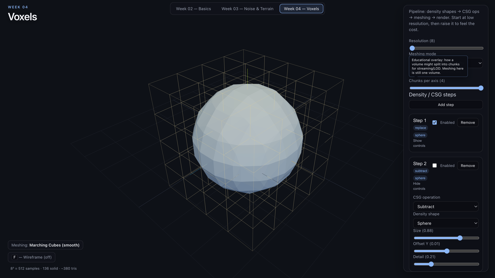

# Assignment 1 — Voxels

## Simple Explanation

**Voxels** are like 3D pixels: small cubes (or sample points) stacked in space.
Instead of storing only a surface, a voxel world stores what fills a volume —
solid, empty, or something in between.

Your Week 3 noise exercise built **height-field terrain**: one elevation value
per `(x, z)` on a 2D grid, then a mesh pushed up into hills. That works great
for landscapes that never fold over themselves, but it struggles with caves,
overhangs, tunnels, and true 3D interiors — because every column can have only
one height.

**Voxel terrain** works in full 3D. Each cell in a volume can be filled or empty
(or hold a density). That makes procedural world building more flexible: you can
carve caves, stack floating rocks, cut arches, and combine shapes the way you’d
sculpt clay — then turn the volume into triangles for rendering.

---

## Mental Model

```text
3D space
  → voxel grid / density field
  → density shapes
  → CSG operations
  → meshing
  → rendered terrain
```

**Briefly:**

1. **3D space** — the region of the world you care about.  
2. **Voxel grid / density field** — sample that space on a regular lattice;
   each sample stores “how solid is this point?”  
3. **Density shapes** — simple formulas (sphere, box, plane, noise blob, …)
   that define densities in space.  
4. **CSG operations** — combine shapes (union, subtract, intersect) so a cave
   can be cut out of a hill, or two blobs merge into one mass.  
5. **Meshing** — convert the discrete volume into triangles the GPU can draw.  
6. **Rendered terrain** — the mesh in your scene (optionally with materials,
   lighting, fog, etc.).

Generation builds *data in a volume*. Meshing builds a *surface you can see*.

---

## Glossary

**Voxel**  
One cell in a 3D grid — think of one Minecraft block, or one sample of “stuff”
at a point in space.

**Voxel Grid / Volume**  
The whole 3D array of voxels, e.g. `64 × 64 × 64` samples covering a chunk of
world.

**Resolution**  
How finely you divide that volume. Higher resolution = smaller voxels = more
detail and more memory/CPU cost. Example: doubling resolution in each axis can
multiply work by about `8×`.

**Density / Density Field**  
A number at each point meaning “how inside / outside solid am I?”  
Example: density `> 0` = solid, `< 0` = empty (conventions vary). Smooth density
fields can describe soft blobs, not only hard cubes.

**Density Shape**  
A recipe that assigns density from position.  
Example: a sphere shape is “distance to center compared to radius.”

**CSG (Constructive Solid Geometry)**  
Building complex solids by combining simpler ones with boolean-like ops:
union (merge), subtraction (carve), intersection (keep overlap).

**Sequential CSG Operations**  
Applying those ops in order. Order matters.  
Example: `(hill − cave) ∪ boulder` is not the same as `(hill ∪ boulder) − cave`.

**Meshing**  
Turning voxel/density data into a triangle mesh for rendering.

**Marching Cubes**  
A common meshing method: look at each cube of 8 neighboring samples, then emit
triangles that approximate the surface where density crosses a threshold. Good
for smooth, organic terrain from a density field.

**Alternative Meshing Techniques**  
Other ways to draw voxels, e.g.:

- **Block / greedy meshing** — visible faces of cubes (Minecraft-like)  
- **Marching Tetrahedra** — similar idea to Marching Cubes, different cell shape  
- **Dual Contouring / Surface Nets** — often sharper features or different tradeoffs  

You don’t need all of them; you should know *that* options exist and *what*
they trade (look vs cost vs feature preservation).

**Chunk / Chunking**  
Splitting a large world into smaller volumes (chunks) so you generate, mesh,
load, and unload pieces instead of one giant grid.  
Example: many `32³` chunks instead of one `512³` volume.

**Voxel Optimization**  
Tricks to stay fast: lower resolution where possible, chunking, only remesh
what changed, skip empty regions, greedy face merging for cubes, LOD, etc.

---

## Examples

**1. Block / Minecraft-style terrain**  
Each voxel is solid or air. Meshing draws the outer faces of solid cubes.
Editing is easy (place/remove a block). Surfaces look stepped unless you add
smoothing later.

**2. Density + CSG subtraction for a cave**  
Start with a density shape for a hill (or noise-filled volume). Subtract a
tunnel or blob shape with CSG. The density field now has an empty path through
the solid — a cave — without painting every voxel by hand.

**3. Marching Cubes for smooth terrain**  
Fill a volume with smooth densities (noise, spheres, CSG results). Marching
Cubes finds the isosurface and builds a continuous mesh. Same volume idea as
blocks, but the result looks more like clay or soft rock than a pixel grid.

---

## In-Class Exercise

Assignment goals for this week:

- Create voxel terrain in a **different tab** (alongside existing views)
- Explore and implement different **density shapes**
- Explore and understand **CSG** techniques and **sequential** operations
- Consider limits of size and performance; explore and document **why chunking
  is needed**
- Implement a **meshing** solution such as **Marching Cubes**
- Document and understand features of **alternative meshing** techniques
- Explore ways to **optimize** a voxel structure

---

## Questions to Explore

Answer these by interacting with your implementation:

- What changes as voxel **resolution** increases?
- How do different **density shapes** affect the volume?
- What happens when **CSG** operations are applied **sequentially**?
- How does **Marching Cubes** differ from **block-style** voxel rendering?
- How does increasing resolution / world size affect **performance**?
- Why does **chunking** become useful for larger worlds?

---

## How My Implementation Works

The Week 04 tab follows the pipeline from the mental model: sample a volume,
combine density shapes with CSG, mesh the result, then draw it in Three.js.

The sampled region is roughly `[-1, 1]³`. Resolution is samples per axis
(default `20`, so `20³ = 8000` samples). At each grid point the code evaluates
every **enabled** density step in order:

1. The first enabled step is the **base field** (treated as replace, even if
   the dropdown says something else).
2. Later steps combine with **union**, **subtract**, or **intersect**.
3. Density `> 0` is solid, `< 0` is empty.

Shapes are signed-density formulas, not meshes: **Sphere**, **Box**,
**Ground Plane**, **Torus**, and **Noise Blob**. Size is the main radius /
half-extent. Offset Y moves a shape up or down. Detail is shape-specific
(plane thickness, torus tube radius, noise frequency).

The density array still stores **solid interior samples**. Meshing only builds
the **visible boundary**.

**Block meshing** walks solid cells and emits a quad only if the neighbor in
that direction is empty (exposed-face culling). Interior faces are skipped.
The surface looks like Minecraft cubes.

**Marching Cubes** looks at each cube of 8 neighboring samples, classifies it
into one of the **standard 256 cases**, and uses lookup tables (`EDGE_TABLE` /
`TRI_TABLE`) to emit triangles where density crosses `0`. Empty cells
(`edgeMask === 0`) are skipped. The surface is a continuous triangle mesh.

**Chunking in this exercise is visual only.** “Show chunk boundaries” draws
wireframe boxes over the volume. Raising chunks-per-axis splits that overlay,
but meshing is still **one volume**, not independently generated chunks.

**Optimizations that are actually in the code:**

- block meshing: only exposed faces
- Marching Cubes: skip empty cells

**Not implemented** (possible later): per-chunk meshing/streaming, LOD, greedy
meshing, remeshing only dirty regions.

### Alternative meshing techniques (comparison)

| Method | What it builds | Look | Notes |
|---|---|---|---|
| **Block meshing** | Cube faces of solid cells | Stepped / Minecraft | Simple; we cull hidden faces. Greedy meshing would merge coplanar faces later. |
| **Marching Cubes** | Isosurface from 8-corner cubes | Smooth, organic | 256-case tables; good for density blobs. Can blur sharp corners. |
| **Marching Tetrahedra** | Same idea, tetra cells instead of cubes | Also smooth | More triangles, fewer ambiguous cube cases. Not in this repo. |
| **Dual Contouring** | Vertices inside cells (often using gradients) | Can keep sharper edges | Better for CSG-style corners; more complex. Not in this repo. |

This exercise implements **blocks** and **Marching Cubes** so you can compare
a voxel look vs a continuous isosurface on the same density field.

---

## Experiments & Observations

I used the Week 04 controls and noted the following:

- Changing **Size** changes the volume occupied by a density shape.
- Different density shapes include **Sphere**, **Box**, **Ground Plane**,
  **Torus**, and **Noise Blob**.
- **Ground Plane** extends across the sampled volume rather than behaving like
  a bounded object.
- **Noise Blob** can extend beyond the sampled volume and gets clipped by its
  boundary.
- **Subtract** removes one volume from another; **Union** combines them;
  **Intersection** keeps the overlapping region.
- **Block meshing** produces a voxel/block-like surface; **Marching Cubes**
  produces a triangle-based continuous surface.
- **Lower resolution** produces coarser geometry; **higher resolution**
  produces finer geometry at greater computational cost.
- **Chunk boundaries** divide the volume visually without changing the shape
  itself.

---

## Reflection

Height-field terrain (Week 3) is one elevation per `(x, z)`. Voxels are a full
3D field, so you can carve a sphere out of another sphere and still have
interior samples even when the mesh is only a shell.

The CSG ops matched what I expected: subtract carves, union adds, intersect
keeps overlap. Ground Plane felt different from Sphere/Box/Torus because it
fills across the volume instead of sitting as a bounded object. Noise Blob
could spill outside the grid and then get cut off at the sample bounds.

Meshing is a display choice on the same data. Blocks look like cubes because
only exposed faces are drawn. Marching Cubes looks smoother because it
interpolates across the zero isosurface using the 256-case tables.

Resolution is the obvious cost knob: coarser is cheaper, finer is slower.
Chunk overlays made it clear *why* games split worlds — a huge grid would be
expensive — but this implementation does not actually mesh per chunk. For a
larger world you would want that, plus things like LOD or greedy meshing, which
are not here yet.

---

## Result

The finished exercise lives in the **Week 04 — Voxels** tab (alongside Week 02
and Week 03). Default settings are resolution `20`, **block** meshing, chunk
bounds on (`2` per axis), a base **sphere**, a second **sphere** subtracted,
and a third **box** union step that starts disabled.

The canvas shows the meshed volume, a stats line (samples / solid count /
triangles), and a side panel for resolution, meshing mode, chunk overlay, and
the CSG step list. Switching meshing mode rebuilds the surface from the same
density field. Press **F** for wireframe.


*Block meshing: a sphere with another sphere subtracted, plus chunk-boundary overlay.*



*Marching Cubes: a smoother isosurface of a sphere, still with chunk bounds drawn on top.*

