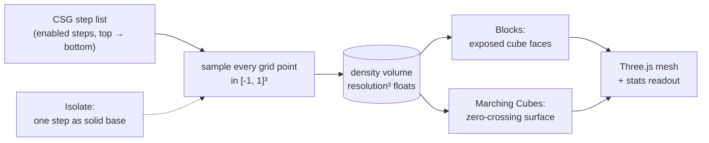
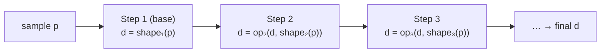
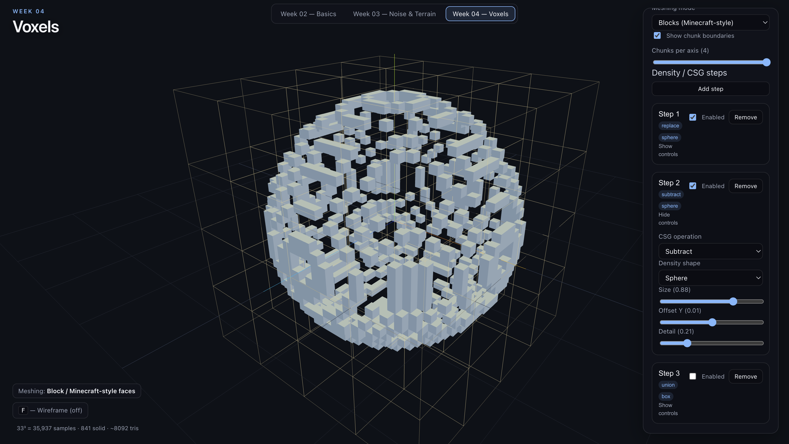
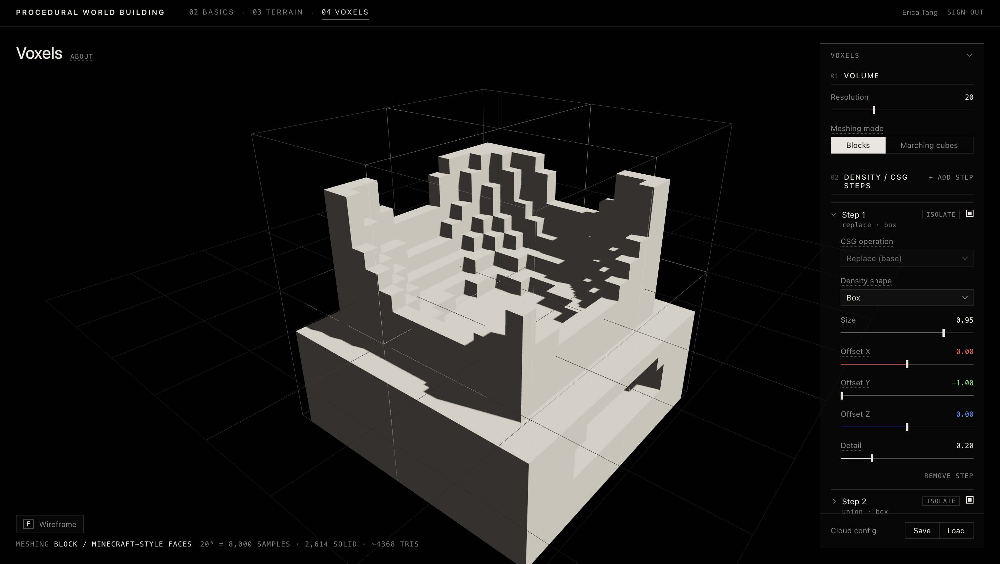

# Week 04 — Voxels

> A list of signed-density shapes, combined top to bottom with CSG, is sampled into a 3D grid and meshed as either Minecraft-style blocks or a Marching Cubes surface.

---

## Why It Matters

- **Full 3D form:** a Week 03 height field stores one height per `(x, z)`, so it can't fold over itself. A density volume stores *inside or outside* at every 3D point: overhangs, cavities, tunnels, stacked masses.
- **Composition by operations:** complex solids come from a short, editable list of simple shapes and boolean steps, not hand-modelled geometry.
- **Data vs. surface:** generation fills a volume; meshing is a separate, swappable step that decides how that volume looks and what it costs.
- **Scale pressure:** sample count grows with resolution³, which is why real voxel worlds need chunking, streaming and smarter meshing.

---

## Core Concepts

| Concept | Meaning |
|---|---|
| **Density field** | A function of position; here **density > 0 is solid**, ≤ 0 is empty. Built from signed-distance-like shape formulas. |
| **Volume** | The field sampled on a `resolution³` grid spanning `[-1, 1]³` (default 20³ = 8,000 samples). |
| **Density shape** | Sphere, Box, Ground plane, Torus or Noise blob, each with Size, Offset X/Y/Z and a shape-specific Detail. |
| **CSG step** | One shape combined into the running field with **replace**, **union**, **subtract** or **intersect**. |
| **Sequential CSG** | Steps run top to bottom; each step combines with the result of all steps above it, so order matters. |
| **Enable / Isolate** | Enable includes a step in the composite. Isolate previews one step's shape alone, as solid. |
| **Block meshing** | Draw the exposed faces of solid cells as cubes. |
| **Marching Cubes** | Build a triangle surface where density crosses 0, interpolated along cell edges. |
| **Chunk** | A sub-volume of a larger world. Here only a visual overlay. |

---

## How It Works

### 1. Pipeline


```mermaid
flowchart LR
  S["CSG step list<br/>(enabled steps, top → bottom)"] --> V
  I["Isolate:<br/>one step as solid base"] -.-> V
  V["sample every grid point<br/>in [-1, 1]³"] --> D[(density volume<br/>resolution³ floats)]
  D --> B["Blocks:<br/>exposed cube faces"]
  D --> M["Marching Cubes:<br/>zero-crossing surface"]
  B & M --> R["Three.js mesh<br/>+ stats readout"]
```

### 2. Shapes and XYZ positioning

Every shape is evaluated at the sample point minus its offset, `p − (offsetX, offsetY, offsetZ)`, so offsets translate the whole shape. There is no rotation or non-uniform scale.

| Shape | Density (at local point) | Size | Detail | Positioning notes |
|---|---|---|---|---|
| **Sphere** | `size − length(p)` | Radius | — | Moves freely in X/Y/Z |
| **Box** | Signed distance to a box, half-extents `(size, 0.7·size, size)` | Half-width | — | Always a little flatter than it is wide |
| **Ground plane** | `thickness − abs(py)` | — | Thickness | Infinite horizontal slab: only Offset Y has an effect |
| **Torus** | Ring of radius `size` around the Y axis | Ring radius | Tube radius | Always lies flat in the XZ plane |
| **Noise blob** | Sphere + `0.18 · sin·cos·sin` lobes | Radius | Noise frequency (`1.5 + 6·detail`) | Lobes move with the shape and flip sign across diagonals |

### 3. Sequential CSG


```mermaid
flowchart LR
  P[sample p] --> S1["Step 1 (base)<br/>d = shape₁(p)"]
  S1 --> S2["Step 2<br/>d = op₂(d, shape₂(p))"]
  S2 --> S3["Step 3<br/>d = op₃(d, shape₃(p))"]
  S3 --> SN["… → final d"]
```

| Op | Combine `a` (field so far) with `b` (this shape) | Effect |
|---|---|---|
| Replace | `b` | Base field (first enabled step) |
| Union | `max(a, b)` | Add volume |
| Subtract | `min(a, −b)` | Carve `b` out |
| Intersect | `min(a, b)` | Keep only the overlap |

**Why order matters:** a chain of only unions (or only intersects) gives the same result in any order, but mixing ops doesn't, and subtract is order-sensitive on its own. In the default, the courtyard sphere is subtracted *after* the keep is added. If it came before, the keep's union would refill the courtyard. Each step only sees what's above it.

**Enable vs. Isolate:**

- **Disabled** steps are skipped when the volume is built. The first *enabled* step always acts as the base, whatever its op says, so disabling step 1 promotes step 2.
- **Isolate** renders one step alone as `replace` (solid), even if it's disabled or a subtract. Seeing a subtract step's shape as a solid shows exactly what it carves. Only one step can be isolated; the readout says *"Isolated Step N · shape · shape alone, before CSG"* and **Show composite** returns to the full result.

### 4. Blocks vs. Marching Cubes

Both read the same volume; switching mode only re-meshes.

| | Blocks | Marching Cubes |
|---|---|---|
| Per cell | Solid sample → cube; emit a face only where the neighbour is empty | 8 corner densities → 1 of 256 cases → triangles from lookup tables |
| Surface | Stepped, axis-aligned, flat-shaded | Continuous, interpolated along edges where density crosses 0 |
| Best for | Editable blocks, crisp massing (the ruin default) | Organic blobs, noise, soft CSG |
| Triangles, default at res 20 | ~4,368 | ~3,662 |

---

## Implementation

### Key Files

| File | Role |
|---|---|
| `app/src/weeks/week04/voxels/types.ts` | `DensityStep` / `VoxelSettings` types, shape and op options, default steps |
| `app/src/weeks/week04/voxels/density.ts` | `sampleDensityShape`: shape formulas + XYZ offset |
| `app/src/weeks/week04/voxels/csg.ts` | `applyCsg`: replace / union / subtract / intersect |
| `app/src/weeks/week04/voxels/buildVolume.ts` | `buildDensityVolume`: samples enabled steps top to bottom into a `Float32Array` |
| `app/src/weeks/week04/voxels/meshBlocks.ts` | Block meshing with exposed-face culling |
| `app/src/weeks/week04/voxels/meshMarchingCubes.ts`, `marchingCubesTables.ts` | Marching Cubes and its edge/triangle tables |
| `app/src/weeks/week04/VoxelExercise.tsx` | Page: panel, step rows (enable/isolate), preview steps, scene (light, shadow, RGB axes, chunk overlay), stats |
| `app/src/shared/ui/instrument.tsx` | Shared `CollapsibleRow` (enable box + header actions such as Isolate) |

Cloud Save / Load in the panel footer is covered in [Week 04 — Firebase](04-02-firebase.md).

### Key Logic

**`buildDensityVolume`**: sequential CSG per sample. Disabled steps are filtered out first:

```ts
const active = steps.filter((step) => step.enabled)
// for every grid point (x, y, z) in [-1, 1]³:
let d = -1
for (let s = 0; s < active.length; s++) {
  const shapeD = sampleDensityShape(x, y, z, step.shape, step.size,
    step.offsetX, step.offsetY, step.offsetZ, step.detail)
  d = s === 0 ? shapeD : applyCsg(d, shapeD, step.op)
}
```

**Isolate** swaps the step list before building, so meshing and stats need no special case:

```ts
const previewSteps = isolatedStep
  ? [{ ...isolatedStep, enabled: true, op: 'replace' as const }]
  : settings.steps
```

**Block face culling**: a face is emitted only if the neighbouring cell is empty or off-grid:

```ts
for (const face of FACE_DEFS) {
  if (isSolid(volume, ix + face.dx, iy + face.dy, iz + face.dz)) continue
  // … emit this face's 4 corners as two triangles
}
```

**Marching Cubes** builds an 8-bit case index from which corners are solid, skips cells with `EDGE_TABLE[case] === 0`, and places each vertex at the zero crossing `t = da / (da − db)` along the edge.

### Parameters / Controls

| Parameter | Default / Range | Effect |
|---|---|---|
| Resolution | 20 · 8–48 | Samples per axis: detail vs. cost (resolution³) |
| Meshing mode | Blocks · Marching cubes | Re-meshes the same volume |
| CSG operation | per step | Step 1 is fixed to Replace (base) |
| Density shape | per step | Sphere / Box / Ground plane / Torus / Noise blob |
| Size | 0.05–1.2 | Radius / half-extent |
| Offset X · Y · Z | −1–1 | Shape position; red, green and blue, matching the viewport axes |
| Detail | 0.02–0.8 | Torus tube, plane thickness, noise frequency |
| Enable box · Isolate · Remove step | per step | Include in composite · preview alone · delete (at least one step stays) |
| + Add step | union sphere, size 0.35, Offset Y 0.2 | Appends to the bottom of the list |
| Show chunk boundaries · Chunks per axis | on · 2 (1–4) | Overlay only |
| Wireframe (F) | off | Rendering only |

**Default steps**: a ruin-like specimen:

| # | Op · shape | Size | Offset (X, Y, Z) | Detail | Role |
|---|---|---|---|---|---|
| 1 | Replace · box | 0.95 | (0, −1, 0) | 0.2 | Wide plinth |
| 2 | Union · box | 0.75 | (0, 0.1, 0) | 0.2 | Keep |
| 3 | Subtract · sphere | 0.86 | (0.12, 0.6, 0.12) | 0.2 | Off-centre courtyard: corner towers, a front stump, sagging front walls |
| 4 | Subtract · torus | 0.9 | (0, −0.6, 0) | 0.16 | Slots cut into the plinth sides |

---

## Experiments & Observations

Mesh and timing numbers were measured with a headless script running the real volume and meshing code; composition checks used ASCII height maps plus a flood fill from the floor to find floating voxels.

| Tried | Expected | Observed | Why / Next |
|---|---|---|---|
| Old default: a sphere with a second sphere (size 0.88) subtracted (see Before below) | A hollow shell | A speckled, perforated shell of scattered blocks | The remaining shell is thinner than the sample spacing, so sampling breaks it apart |
| Box → sphere bowl → union box | Three readable steps | The Step 3 box sat where the default camera couldn't see it | Moved it below the base as a pedestal reaching the floor |
| Ruin-like massing with Offset Y only | Irregular towers | Every shape was centred on the Y axis, so the result had four identical sides | Only the noise blob's sign-flipping lobes could break the symmetry; a 7-step version used a noise intersect to clip one diagonal pair of towers |
| First 7-step pass | Walls, towers, a solid plinth | The courtyard sphere and breach torus ate the walls, leaving towers on stilts; the plinth torus cut a ring trench through the top; one size exceeded the 1.2 slider max | Retuned until the flood fill found 0 floating voxels |
| Added Offset X / Z | Direct asymmetry | An off-centre courtyard sphere does the job of both noise steps | Default cut to 4 steps: 2,614 solid samples, ~4,368 block triangles at res 20 |
| Resolution 8 → 48 (default steps) | Cost grows with resolution³ | See table below | Build and mesh run on the main thread on every edit |
| Per-direction vertex colours; three's default axes | Clear faces and axes | Faces were told apart by tint rather than light; each axis faded toward a lighter tint and tone mapping shifted it | Warm off-white material with faces separated by light; solid RGB axes exempt from tone mapping; neutral chunk lines |
| Ground plane, noise blob, chunk overlay | Bounded shapes; chunks change the mesh | The plane fills the whole volume; noise blobs spill past the grid and get clipped; chunk boundaries don't change the shape | The volume boundary is a hard edge; chunking here is visual only |

**Resolution vs. cost** (default steps, headless timings are approximate):

| Resolution | Samples | Solid | Build | Blocks tris · time | Marching Cubes tris · time |
|---|---|---|---|---|---|
| 8 | 512 | 148 | ~0.3 ms | 520 · ~0.5 ms | 422 · ~1 ms |
| 20 | 8,000 | 2,614 | ~1.3 ms | 4,368 · ~4 ms | 3,662 · ~2 ms |
| 32 | 32,768 | 12,061 | ~4.5 ms | 12,864 · ~4 ms | 10,958 · ~8 ms |
| 48 | 110,592 | 38,813 | ~15 ms | 28,136 · ~11 ms | 24,102 · ~26 ms |

Samples grow ~14× from 20 to 48, while triangles grow only ~6–7×, since only the surface is meshed. The page currently builds and meshes the volume **twice** per change (once for the mesh, once for the stats readout).

### Before / after applying the Style Guide

| Before | After |
|---|---|
|  |  |

- **Before:** navy background, per-face blue/green tints, yellow chunk lines, boxed step cards with pill tags, top-centre week switcher.
- **After:** world first on a black field, and a warm off-white matte surface whose faces separate through one key light and shadow. Chunk lines are neutral; red/green/blue appears only on the axes and the Offset X/Y/Z values. Steps are a ruled list with enable boxes and Isolate.
- **Not only styling:** the Before shows the old sphere-minus-sphere composition at resolution 33 and 4 chunks per axis. The After shows the current 4-step ruin default at resolution 20.

### Limitations found in the code

- **Chunking is an overlay:** there is one volume and one mesh; there's no per-chunk generation, meshing, streaming or LOD.
- **Blocks are offset:** each solid sample is drawn as the cell from that sample toward +X/+Y/+Z, so the block surface sits about half a cell off the Marching Cubes surface. The last sample layer on the +X/+Y/+Z sides is never drawn.
- **Open boundaries in Marching Cubes:** it only meshes cells inside the grid, so a shape cut by the volume boundary (like the plinth's bottom at y = −1) is left open. Blocks close those faces on the −X/−Y/−Z sides.
- **No mesh optimisation beyond culling:** no greedy face merging and no shared vertices; Marching Cubes normals are per-triangle (faceted).

---

## Takeaways

- **Now I understand:**
  - Generation and meshing are separate problems: the same volume can look like Minecraft or clay.
  - CSG is just `max`/`min` on densities, and the list order *is* the model.
- **Surprised by:**
  - How much positioning freedom shapes the design. With only Y offsets, everything came out four-way symmetric, and I needed a noise trick to break it. With X/Z offsets, one moved sphere does it.
  - Isolate turned subtract steps from invisible to readable.
- **Limitations:**
  - Fixed `[-1, 1]³` volume.
  - Shapes can't rotate or scale non-uniformly.
  - Visual-only chunks.
  - Double build per edit.
  - Everything runs on the main thread.
- **Next:**
  - Real chunked meshing (only remesh what changed).
  - Greedy meshing for blocks.
  - Shape rotation.
  - Building the volume once for both the mesh and the stats.
  - Voxelising the Week 03 height field so the two exercises share a world.

---

## References

### Course

- [Week 04 lecture / material]: voxels, density fields, CSG, meshing, chunking

### External

- [Paul Bourke: Polygonising a scalar field](https://paulbourke.net/geometry/polygonise/): Marching Cubes cases; source layout of the edge/triangle tables used here

<!-- Add any other references actually used (e.g. SDF / CSG articles). -->
