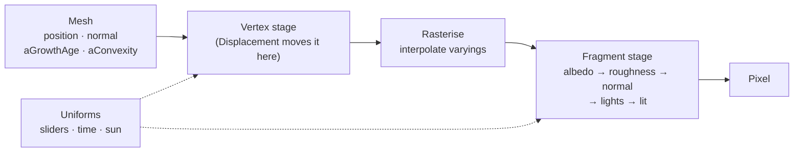
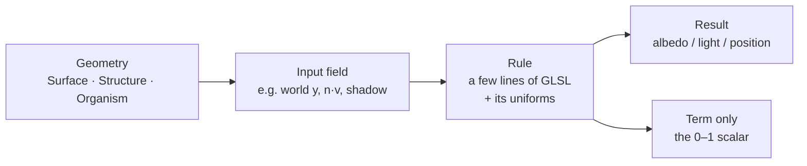
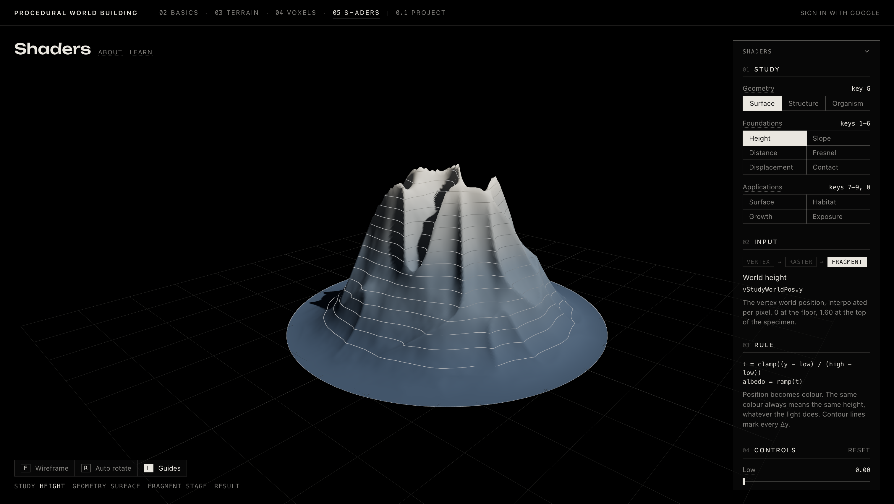

# Week 05 — Shaders

> Ten small GLSL rules, injected into one lit material, read three procedural specimens. Each rule turns something the geometry already carries (height, orientation, view angle, shadow, distance along the surface) into something you can see.

---

## Why It Matters

- **Appearance as a function:** in Weeks 03 and 04, colour was baked into vertices or chosen per block. A shader computes it per pixel, every frame, from the geometry, the light and the camera, so a world's look can react to that world's state.
- **Making fields visible:** slope, exposure, shelter and age are invisible numbers attached to a surface. A shader is the cheapest place to draw them, with no extra geometry and no texture images.
- **Two stages, two powers:** the vertex stage can move the surface itself, including its silhouette and shadow. The fragment stage can only recolour pixels, but it sees everything the lighting sees.
- **Where it fits:** terrain → simulation → structures → persistence → **appearance and fields** → Shadow Ecology. The Project's terrain, architecture and lichen are drawn with the same material factory and GLSL helpers built here.

---

## Core Concepts

| Concept | Meaning |
|---|---|
| **Vertex shader** | Runs once per vertex. Positions it on screen and may move it (`transformed`). |
| **Fragment shader** | Runs once per covered pixel. Decides its colour, reading values interpolated from the vertices. |
| **Rasterisation** | The fixed step between the two: triangles become pixels, and vertex outputs are blended across each triangle. |
| **Uniform** | One value shared by every vertex and pixel in a draw: a slider, the time, a colour, a texture. Every control in the panel is a `uniform float`. |
| **Attribute** | A value stored per vertex in the mesh: `position`, `normal`, and here the precomputed `aGrowthAge` and `aConvexity`. |
| **Varying** | A vertex output interpolated per pixel. The shared ones are `vStudyWorldPos` and `vStudyWorldNormal`. |
| **Field** | Any scalar defined over the surface: height, slope angle, exposure, age. Every study reads one. |
| **Term** | The single 0–1 number a rule computes (`studyTerm`). The *Term only* view shows it directly, black to white. |
| **Specimen** | One of three procedural geometries, all 1.60 tall and resting on the floor: Surface, Structure, Organism. |

---

## How It Works

### 1. Where a rule can run



Only Displacement runs in the vertex stage, which is why it is the only study that changes the outline and the cast shadow. The other nine run per pixel. *Where* in the fragment stage a rule writes matters as much as what it computes:

- Before lighting, in the albedo, roughness or normal, the key light still shades the result: Height, Slope, Distance, Surface, Growth and Exposure.
- After lighting, in `outgoingLight`, the rule overrides or modulates light: Fresnel, Contact and the bright parts of Growth and Habitat.

### 2. Every study has the same shape



The panel is laid out the same way, top to bottom: **01 Study** (which rule, which geometry), **02 Input** (the data it reads, with a Vertex → Raster → Fragment track showing the stage), **03 Rule** (the formula and a one-line reading), **04 Controls** (its uniforms, with Reset), **05 Output** (the variable it writes, a View switch between *Result* and *Term only*, and a legend).

Changing the **study** changes only the rule, while the geometry, light and camera stay the same. Changing the **geometry** keeps the rule and its slider values. That separation is the whole point of the exercise: the same few lines of GLSL read a terrain, a building and an organism differently.



*Height on the Surface specimen, the first study. The ramp is position turned into colour, written before lighting, so the key light still models the massif. The contour lines crowd on steep flanks and spread on flat shoulders, so the form reads even without the ramp.*

### 3. Three specimens

| Specimen | How it's built | What it tests |
|---|---|---|
| **Surface** | A 180-cell heightfield (a broad off-centre massif, a lower shoulder, ridged spurs and fbm detail, fading to the floor at the rim) squeezed onto a disc of radius 1.6 | Continuous slopes, ridges, valleys; a skin that eases onto the floor |
| **Structure** | A union of box signed-distance functions (plinth, terraces, tower, cantilever, portal), meshed by **surface nets** at a 0.02 cell | Flat planes, sharp edges, overhangs, a void |
| **Organism** | Tapered capsule limbs on spreading roots, blended with a polynomial `smoothMin`, meshed by surface nets | Normals facing every direction, thin limbs, soft joints |

All three are single welded meshes. That matters for Displacement: moving vertices along their normals can't tear a mesh that has no duplicated edge vertices.

### 4. LEARN: explain, try, notice

The **LEARN** button opens an 8-step guided tour over the live page rather than a separate demo. Each step gives a short explanation (sometimes with a small diagram), points at the real control or the specimen, and ends with a **Try** and a **Notice**. The rest of the interface dims, the target is outlined in red, and when the step is about the specimen the canvas comes back to full brightness. The steps follow the same order as this tutorial: what a shader is, the three stages, Geometry → Field → Rule → Result, then Height, Fresnel and Displacement, then the applications, and finally the Term view.


*LEARN step 4 on the Structure specimen, with the range narrowed to Low 0.30 and High 1.30. The whole plinth now sits below Low and reads as a single blue, the tower top sits above High and reads as the lightest tone, and the full ramp is spent on the middle storeys. Dragging the outlined sliders slides the colours over the form while the mesh stays put: the difference between a rule and a shape, which is the idea the rest of the tour builds on.*

---

## Foundations

Each foundation isolates one signal. Keys **1–6**.

| Study | Input | Rule (short) | Writes | Stage |
|---|---|---|---|---|
| **Height** | world `y` | `t = (y − low)/(high − low)`, ramp + contours every Δy | albedo | fragment |
| **Slope** | world normal `n.y` | `acos(n.y)` against threshold θ: stone → sediment amber | albedo | fragment |
| **Distance** | world position + probe | `1 − smoothstep(0, r, ‖p − probe‖)`, signal red, rings every 0.1 | albedo | fragment |
| **Fresnel** | view-space `n · v` | `(1 − n·v)^p · k`, added to a dimmed lit colour | light | fragment |
| **Displacement** | `position`, `normal`, time | `p′ = p + n · a · (2·noise(p·f + t·speed) − 1)` | position | **vertex** |
| **Contact** | height above floor on faces turned toward it; footprint distance on the floor | `c = (1 − gap/d)^1.5 · facing · strength`, `light · (1 − c)` | light | fragment |

**What each one teaches:**

- **Height and Slope** are the two fields a terrain generator always has: where a point is, and which way it faces. Both are written to the albedo, so the result is a *classification* the lighting still shades. Slope's amber marks where loose material would slide, so it's a first step from description toward process.
- **Distance** reads nothing about the surface at all. It is a sphere of influence in space, and the surface just happens to intersect it. The rings trace the form's cross-sections, which is how SDF-based effects work.
- **Fresnel** is the first rule that depends on the camera. Orbiting the specimen moves the glow, because `n · v` changes as you move even though the object doesn't. The lit colour is scaled by 0.3 so the rim reads.
- **Displacement** is the only rule that changes geometry. It also has to run in the shadow pass, otherwise the shadow keeps the undisplaced shape. The shading uses face normals rebuilt per pixel from screen-space derivatives, so light follows the new bumps, and pits are darkened toward half brightness.
- **Contact** is a hand-made proximity field, not ambient occlusion: light is removed where the form nearly touches the floor. On the form, the gap is height, weighted by `facing = 1 − max(n.y, 0)` so only walls and undersides count; tops face away from the floor, and without the weight every low shelf darkened. On the floor, the gap is the horizontal distance to the nearest point where the form touches down, precomputed once per geometry. It only knows the floor, so corners between parts of the form stay undarkened.


*Displacement on Structure, with Speed set to 0 so the shape holds still. The Input track lights **Vertex**, not Fragment: this rule runs once per vertex (38,556 here), before rasterisation. The outline is bumpy too, and the self-shadows between the blocks follow the moved surface, which no fragment rule can do. Where the noise frequency outruns the mesh density, the bumps start to alias.*

---

## Applications

Applications combine foundation ideas toward the world. Keys **7, 8, 9, 0**.

| Study | Combines | Result |
|---|---|---|
| **Surface Material** | 3D noise (4-octave fbm of world position) → palette, roughness *and* a derivative bump | A procedural material with no UVs and no seams; every vein is also a groove |
| **Habitat** | shadow-mapped sun exposure × slope footing | Sheltered, flat-enough ground filled in water cyan |
| **Growth** | precomputed surface distance from the floor × a moving threshold | A growth front replayed across the form |
| **Exposure** | sky facing + precomputed convexity | Weathering: exposed faces bleached, rough and pitted; crevices keep a dark patina |

### Surface Material: one field, three channels

A single noise value drives the colour (Stone, Slate or Ochre palettes), the roughness (0.65 → 1) and a bump that tilts the normal. Because they share one field, dark veins are also rough and recessed, which reads as *material* rather than a painted pattern. Relief only changes the normal, so unlike Displacement the silhouette stays smooth.

### Habitat: reading the lighting itself

Habitat is the only rule that runs *inside* the lighting, right after three.js has computed the key light with its shadow applied. There it reads `habitatExposure = max(n · l, 0) · shadow`, then:

```text
shelter = 1 − smoothstep(e₀ ± 0.05, exposure)
footing = 1 − smoothstep(slope₀ ± 5°, slope)
habitat = shelter · footing
```

In this study the sun is a control: azimuth and elevation move the key light, and a small marker shows where it is. Moving it moves the shadows, and the habitat migrates with them. The cyan is mixed in *after* lighting and unlit, so it stays readable deep in shade, which is exactly where it lives. It sits only where two conditions overlap: in shadow **and** on a face flat enough for footing. Shaded vertical walls fail the slope test, and sunlit terraces fail the shelter test.

### Growth: time as a threshold on a field

The Growth field is computed once per geometry on the CPU: Dijkstra's shortest paths over the mesh edges, starting from every vertex resting on the floor, normalised so the last vertex reached is 1. Growth therefore climbs around corners and along limbs, never jumping through the air. The shader only compares:

```glsl
float studyTerm = 1.0 - smoothstep(uGrowthProgress - growthAa, uGrowthProgress + growthAa, vGrowthAge);
float growthYoung = studyTerm * (1.0 - smoothstep(0.0, max(uGrowthEdge, 1e-3), uGrowthProgress - vGrowthAge));
```

Scrubbing **Growth progress** replays the process instantly, because nothing is simulated per frame. The history is already in the geometry. **Edge width** sets how deep the bright "young" band behind the front is, and rings every 0.05 of age record where the front has been, like growth lines.


*Growth on Organism at progress 0.50. The front has climbed from the roots up the trunk and is about to reach the fork. The bright young band sits just behind it, and the rings below record where it has been. The limbs are still ungrown stone, because the age field measures distance along the surface from the floor, and they are the farthest from it.*

### Exposure: openness becomes wear

Exposure averages two cues: **sky facing**, `(n.y + 1) / 2`, and **convexity**, meaning how far each vertex stands proud of a heavily smoothed copy of the mesh (24 Laplacian passes, mapped by the 95th percentile). Ridges, edges and tips score high; crevices and inner corners score low. **Exposure E** moves the onset line (`e = 1 − E`) down into the form as the environment gets harsher, and **Weathering strength k** sets how far a fully exposed face wears, affecting bleaching, roughness and pit depth together.


*Exposure on Surface with **View: Term only**. Lighting is removed and the rule's own 0–1 value is shown: ridges and summits white, gullies black. Switching back to Result shows the same pattern as bleached, pitted stone over a dark patina. Seeing the term first makes the material legible: the wear isn't decoration, it's this field.*

---

## Implementation

### Key Files

| File | Role |
|---|---|
| `app/src/shared/shaders/surfaceMaterial.ts` | `createSurfaceMaterial`: injects a study's GLSL chunks into a matte `MeshStandardMaterial`; adds the Term view and a matching shadow-depth material |
| `app/src/shared/shaders/glsl.ts` | `LINE_GLSL` (screen-space anti-aliased lines), `NOISE_GLSL` (hash + value noise), `SUN_EXPOSURE_GLSL` (shadowed sun exposure) |
| `app/src/weeks/week05/studies.ts` | Data only: each study's input, rule text, output, controls, legend, colours and fixed constants |
| `app/src/weeks/week05/studyShaders.ts` | The GLSL for each study, keyed by the same id; the Contact floor shader |
| `app/src/weeks/week05/studyMaterial.ts` | Builds one material per study, pushes slider values into uniforms, toggles Term view and Guides |
| `app/src/weeks/week05/specimen.ts` | The three specimens and the Contact footprint distance texture |
| `app/src/weeks/week05/surfaceNets.ts` | Surface nets mesher for the Structure and Organism distance fields |
| `app/src/weeks/week05/fields.ts` | Per-vertex `aGrowthAge` (Dijkstra) and `aConvexity` (Laplacian smoothing) |
| `app/src/weeks/week05/ShadersWeek.tsx`, `ShaderSpecimen.tsx` | Page, panel, scene (key light, shadow, sun marker, floor), keyboard shortcuts |
| `app/src/weeks/week05/learnSteps.tsx`, `learnFigures.tsx` | The 8-step LEARN tour and its small diagrams |

### Key Logic

**`createSurfaceMaterial`**: instead of writing a full `ShaderMaterial`, each study supplies a few named chunks, and three.js's own `MeshStandardMaterial` source is patched in `onBeforeCompile`. The key light, shadow maps and tone mapping all keep working, and each rule only has to say *where* it writes:

| Chunk | Injected after | Typical use |
|---|---|---|
| `vertex` | `begin_vertex` | Move `transformed` (Displacement); pass attributes on (Growth, Exposure) |
| `albedo` | `color_fragment` | Recolour `diffuseColor` before lighting |
| `roughness` | `roughnessmap_fragment` | Surface, Exposure |
| `normal` | `normal_fragment_maps` | Derivative bump (Surface, Exposure pits) |
| `lights` | `lights_fragment_begin` | Read `directLight` with its shadow (Habitat) |
| `lit` | before `opaque_fragment` | Modify final light; draw guide lines |

The Term view is one extra line after tone mapping, so `studyTerm` reads 0 → black, 1 → white regardless of light:

```ts
.replace(
  '#include <tonemapping_fragment>',
  `#include <tonemapping_fragment>
gl_FragColor.rgb = mix(gl_FragColor.rgb, pow(vec3(clamp(studyTerm, 0.0, 1.0)), vec3(2.2)), uShowTerm);`,
)
```

When a shader has a vertex chunk, the same injection is applied to a `MeshDepthMaterial`, so the shadow map sees the displaced surface too.

**A whole study is a few lines.** Contact on the specimen is the smallest:

```glsl
// albedo chunk: compute the term
float contactGap = max(vStudyWorldPos.y, 0.0);
float contactFacing = 1.0 - max(normalize(vStudyWorldNormal).y, 0.0);
float studyTerm = pow(1.0 - clamp(contactGap / uContactDistance, 0.0, 1.0), 1.5) * contactFacing * uContactStrength;
// lit chunk: apply it after lighting
outgoingLight *= 1.0 - studyTerm;
```

The floor half of Contact uses the same rule, but reads its gap from a 256² half-float texture: an exact 2D distance transform (Felzenszwalb & Huttenlocher) of the specimen's footprint, covering 6 units and storing gaps up to 1.25.

**Guide lines** (contours, iso-lines, rings) come from `LINE_GLSL`. Widths are measured in screen pixels using `fwidth`, so a contour stays one pixel wide whether you zoom in or out, and it fades out where lines would crowd into mush. Every guide is multiplied by `uGuides`, so the **L** key hides the explanation without changing the result.

### Parameters / Controls

| Study | Controls (default · range) | Effect |
|---|---|---|
| Height | Low 0 · High 1.60 (0–1.6); Contour Δy 0.10 (0–0.4, 0 = off) | Which heights span the ramp; contour spacing |
| Slope | Threshold θ 35° (0–90°); Softness s 3° (0–30°) | Where faces turn amber; hard vs. soft edge |
| Distance | Probe X 0.60 · Probe Y 1.20; Radius r 1.00 | Moves and sizes the sphere of influence (a small marker shows the probe) |
| Fresnel | Power p 3.0 (0.5–8); Strength k 0.90 (0–1.5) | Rim tightness and brightness |
| Displacement | Amplitude a 0.120 (0–0.3); Frequency f 3.0 (0.5–8); Speed 0.30 (0–2, 0 = still) | Bump height, size, and how fast the field scrolls |
| Contact | Distance d 0.40 (0.02–1); Strength 0.85 (0–1) | Reach and depth of the darkening, on form and floor |
| Surface | Scale 3.5 (0.5–12); Contrast 2.5 (0.5–6); Relief 0.015 (0–0.05); Palette Stone / Slate / Ochre | Grain size, one-tone vs. two-material split, bump depth, colour family |
| Habitat | Sun azimuth 170° · elevation 30° (5–85°); Shelter e₀ 0.30; Max slope 55° | Moves the key light; how dark and how flat counts as habitat |
| Growth | Growth progress 0.55 (0–1); Edge width w 0.080 (0.005–0.3); Show field Off / On | Front position; depth of the young band; grey age field instead of material |
| Exposure | Exposure E 0.50 (0–1); Weathering strength k 0.85 (0–1); Show field Off / On | Onset of weathering; how far worn faces go; grey exposure field |

**Page-wide:** Geometry Surface / Structure / Organism (**G**), study keys **1–9, 0**, View *Result* / *Term only*, **F** wireframe, **R** auto rotate, **L** guides, **LEARN** (8-step tour), drag to orbit, scroll to zoom.

**Scene:** camera at (3.4, 2.4, 3.8) looking at (0, 0.7, 0); one key light (intensity 3, 2048² shadow map) plus a dim ambient 0.2; black background with a faint 6-unit floor grid. Keeping the light identical across studies is deliberate: when you switch rule, nothing else moves.

---

## Experiments & Observations

| Tried | Expected | Observed | Why / Next |
|---|---|---|---|
| First Surface specimen: flat disc rim + fbm peak | A mountain island | A flat plate with a steep, spiky needle in the middle | Broadened the massif, started the rim falloff earlier and lowered the high-frequency fbm; checked slope statistics from the mesh normals rather than by eye |
| Planned Structure as merged, subdivided boxes | Crisp architecture that displaces cleanly | Displacing along normals would split every hard edge, because box faces don't share vertices | Built it as a box SDF union meshed by surface nets: one welded mesh, edges softened by about one cell |
| First Structure build | Fast enough to rebuild on switch | ~850 ms | `Math.hypot` and per-edge allocations in the hot loops; removed both |
| First Organism: thin, fast-tapering limbs | A branching crown | Outer limbs were about one 0.022 cell wide, so surface nets broke them up and the crown vanished | Thicker limbs, gentler taper, shorter trunk |
| Contact on Surface | A soft dark moat at the base | A jagged, sawtooth dark ring | Three causes: the floor plate sat just *above* y = 0 and depth-fought the specimen's skirt; the gap texture was 8-bit, so thin rings stair-stepped; the field stopped at a gap of 1, which was also the slider max. The plate now sits just below 0, the texture is half-float, and the range reaches 1.25 |
| Pale circular Contact floor | A neutral ground | Read as a white spotlight | Dark graphite ground that fades into the black field, with the grid showing through |
| Streaks on the Surface's steep walls, in several studies | A contour or shader bug | Neither: shadow edges follow the 180-cell heightfield's facets while smooth normals shade smoothly (the "shadow terminator" problem) | A mesh-resolution limit; left as is rather than retuning every specimen |
| A global Contours toggle for Week 05, like Weeks 03 and 04 | Consistency | Height's contours *are* its rule; an overlay on every study would blur what each rule says | Instead, **L Guides**: each study's own explanatory lines, hideable, without changing the result |

**Rules behave differently on each specimen**, which was the main thing the geometry selector made visible:

- **Slope** grades continuously across Surface's flanks. It is nearly binary on Structure: tops stay stone and walls turn amber, because every face is flat or vertical. On Organism almost everything is amber; only a few fork crotches and upturned tips are flatter than 35°.
- **Habitat** at the default sun (170°, 30°) pools across Surface's shaded flanks and the flat apron on that side. On Structure it is sharp-edged and architectural, filling shaded terraces and the plinth under the cantilever. On Organism it shrinks to thin strips along the tops of shaded limbs and roots, the only places that are both flat enough and out of the sun.
- **Exposure** needs convexity. Sky facing alone paints every flat terrace of Structure the same; convexity separates proud edges from inner corners.

---

## Connection to Shadow Ecology

Week 05 is where the Project's visual language was worked out on neutral specimens before being applied to the world.


| Week 05 study | In Shadow Ecology |
|---|---|
| **Habitat** (instant shadow → shelter) | Terrain and architecture read the sun through the same `SUN_EXPOSURE_GLSL` lights chunk. Habitat itself became a **simulation**: remembered daylight shelter, moisture and footing, computed over days and handed to the terrain shader as a texture, which stains it into the ground as lichen. |
| **Growth** (age vs. progress) | Architecture colour records its growth: each block's `aBirth` compared with `uArchClock`, the same "time as a threshold on a stored value". |
| **Exposure** (openness → wear) | Blocks carry `aWeather`, derived from decay's own weighting of open, proud and overhanging form. With age, it drives intact graphite → weathered mineral grey → heavily weathered friable stone before decay removes them. |
| **Surface Material** (one noise, several channels) | Staining, mottling and relief on terrain and blocks use `NOISE_GLSL` to drive colour, roughness and normal together. |
| **Guides / Term view** | The Project's **Field** view and **C** contours: analytical linework from `LINE_GLSL` that can be switched off without changing the world. |

**The most important lesson came from Habitat.** A fragment shader only knows *this frame*: where the shadow falls right now. An ecology needs *memory*: ground that has been shaded for days, not just at this moment. So the shader study became the prototype for the rule, and the Project moved the rule itself into the simulation. The shader went back to what it's best at: drawing a field that already exists.

---

## Takeaways

- **Now I understand:**
  - A shader is a function from *what the surface already knows* to a colour or position. Most of the design work is choosing the input field and *where* to write the result: before lighting, after lighting, or in the vertex stage.
  - Precomputation and shaders are partners: expensive, global questions (surface distance, convexity, footprint distance) are answered once per geometry on the CPU; the shader answers the cheap, local, interactive one ("is this vertex older than the slider?").
  - Keeping the stock lit material and injecting chunks is far less work than a raw `ShaderMaterial`, and shadows, tone mapping and the key light come for free.
- **Surprised by:**
  - How much the *Term only* view helps. Seeing the bare 0–1 field first makes every coloured result easier to read, and it doubles as a debugging tool.
  - How much geometry matters to a rule. The same few lines of Habitat give a broad pool on a terrain apron, a sharp patch under a cantilever, and a thin strip along a limb.
  - That most artifacts weren't shader bugs: depth-fighting, 8-bit precision and mesh facets caused the ugliest ones.
- **Limitations:**
  - Habitat is instantaneous: no memory, no moisture, no spread.
  - Growth and exposure fields are static per geometry; the shader animates a threshold, not a process.
  - Displacement is limited by mesh density and doesn't update the precomputed fields.
  - One directional light; `SUN_EXPOSURE_GLSL` assumes the sun is the only one.
- **Next:**
  - Feed simulated fields (as in the Project) back into studies, so a rule can read history.
  - A second light or sky term for softer exposure.
  - Recomputing the growth and convexity fields after displacement, so the rules can stack.

---

## References

### Course

- Week 05 lecture / material: shaders, vertex and fragment stages, uniforms, varyings, procedural materials

### External

- [The Book of Shaders](https://thebookofshaders.com/): fragment-shader thinking, shaping functions, noise and fbm
- [three.js `Material.onBeforeCompile`](https://threejs.org/docs/#api/en/materials/Material.onBeforeCompile): patching `MeshStandardMaterial`'s shader chunks instead of replacing the material
- [Inigo Quilez: Distance functions](https://iquilezles.org/articles/distfunctions/) and [Smooth minimum](https://iquilezles.org/articles/smin/): the box and capsule SDFs and the polynomial `smoothMin` behind Structure and Organism
- [Mikola Lysenko: Smooth Voxel Terrain, Part 2](https://0fps.net/2012/07/12/smooth-voxel-terrain-part-2/): surface nets
- [Felzenszwalb & Huttenlocher: Distance Transforms of Sampled Functions](https://cs.brown.edu/people/pfelzens/papers/dt-final.pdf): the exact 2D distance transform used for the Contact floor
- [Morten Mikkelsen: Bump Mapping Unparametrized Surfaces on the GPU](https://mmikk.github.io/papers3d/mm_sfgrad_bump.pdf): the derivative-based bump used by Surface and Exposure
