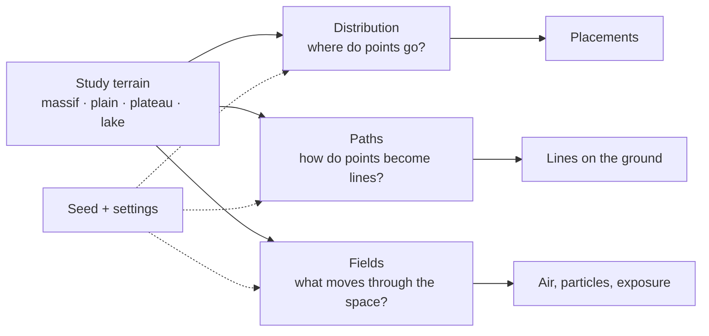
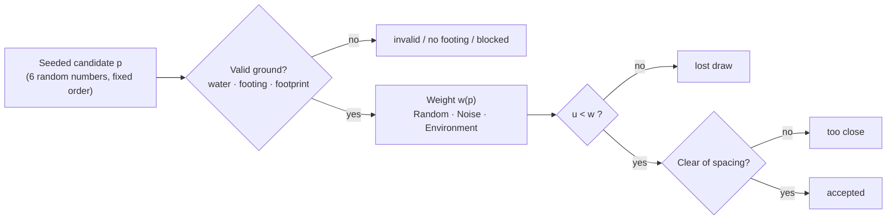
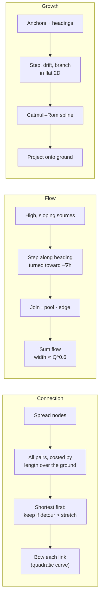
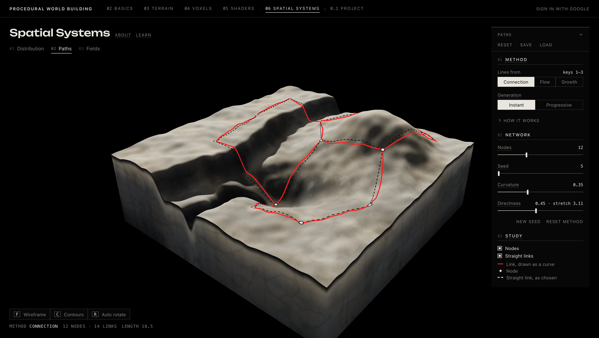
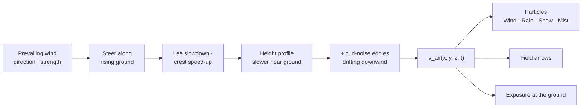
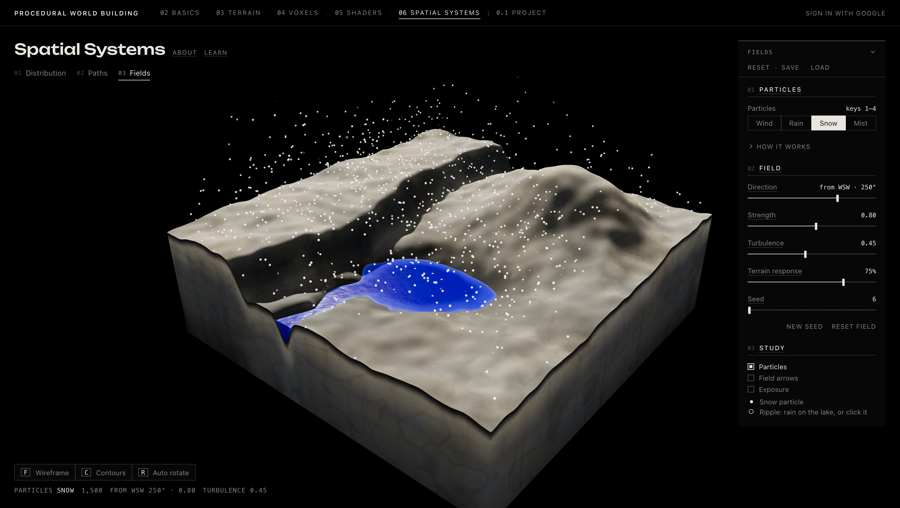
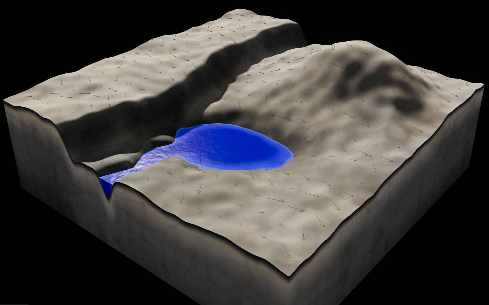
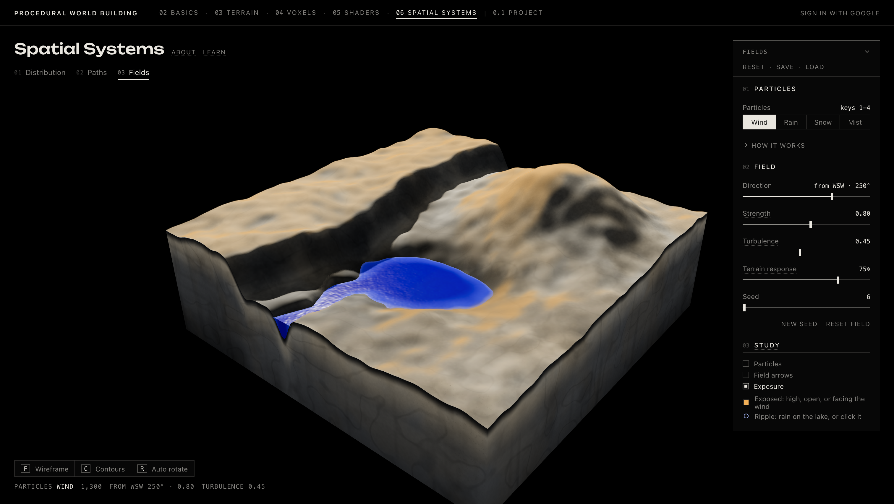
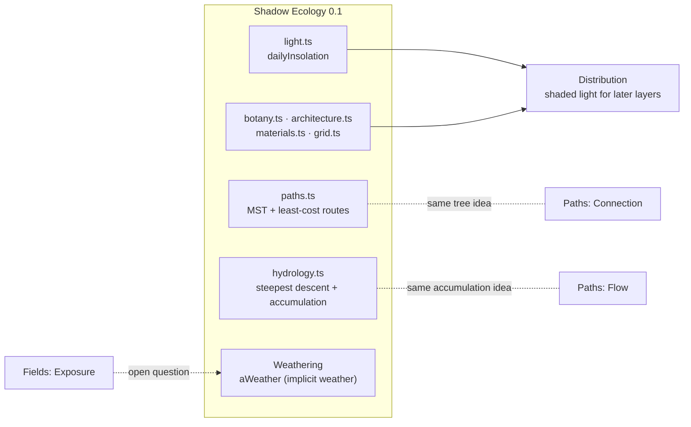

# Week 06 — Spatial Systems

> Three studies on one block of terrain, each asking how things spread across space: **Distribution** scatters points, **Paths** turns points into lines, **Fields** fills the air with a vector field. All three read the same ground, and none of them is decided by one random draw: the terrain, a seed and a few rules decide where things go.

---

## Why It Matters

- **From one object to many:** Weeks 03–05 built one surface, one structure, one material. A world also needs *arrangement*: where buildings stand, where plants grow, which way water runs and where the wind is felt. Those are spatial systems, and they turn a terrain into a place.
- **Rules instead of placement by hand:** every result here comes from a seed, a terrain and a small rule. Change the ground or a preference and the layout follows; keep the seed and settings and it is identical every time.
- **Three kinds of spatial answer:** points (*where*), lines (*how things connect or move*) and fields (*what is everywhere at once*). Most procedural world systems are one of these or a combination of them.
- **Where it fits:** terrain → **distribution · paths · fields** → structures and ecology → Shadow Ecology. The studies reuse the Project's light trace, grid, materials, plant forms and architecture module, so what is learned here transfers directly.

---

## Core Concepts

| Concept | Meaning |
|---|---|
| **Study terrain** | One shared 5.2 × 5.2 block (`STUDY_HALF` 2.6) with a massif at the back right, a near-level plain in the centre, a plateau ending in an escarpment on the left, and a basin lake with an outlet channel at the front. Each condition is kept apart so it reads on its own. |
| **Candidate** | A seeded point that *might* be accepted. Distribution draws many more candidates than it needs and lets the rules choose. |
| **Valid ground** | A hard rule: on the block, off water unless a layer allows it, with footing for structures, and outside structure footprints for later layers. Invalid ground is never chosen, whatever its weight. |
| **Weight** | A 0–1 number per candidate: the chance it survives the draw. The method (Random, Noise, Environment) only changes the weight. |
| **Environmental field** | A scalar over the ground: elevation, slope, moisture, light, nearness to water. Environment multiplies a layer's preferences for them. |
| **Spanner** | A network that keeps every trip within a factor (the *stretch*) of the direct distance. A stretch of ∞ gives a tree. |
| **Gradient (∇h)** | The direction in which the ground rises fastest. Water steps along −∇h. |
| **Flow accumulation** | Each channel carries the sum of the flow of every source above it, so it widens below each confluence. |
| **Heading / drift** | Growth's direction of travel, turned a little each step by coherent noise. |
| **Projection** | Laying a line drawn in plan onto the ground: `P(x, z) = (x, h(x, z), z)`. |
| **Vector field** | A direction and speed at every point in space. In Fields this is the air, `v_air(x, y, z, t)`. |
| **Curl noise** | The curl of a noise "stream function": swirls without sources or sinks, used for the eddies. |
| **Exposure** | A 0–1 reading of the field at the ground: high, open, or facing into the wind. |

---

## How It Works

### 1. One terrain, three questions



Week 06 opens on three tabs, **01 Distribution · 02 Paths · 03 Fields**, which share one camera, the same sun (hour 15.5), the Project's terrain and water materials, About and LEARN, page snapshots (Save / Load), and the **F** wireframe, **C** contours and **R** auto-rotate view tools. Everything that changes between the tabs is the system being studied, so the three studies can be compared directly. Each study is deterministic: a seed and the settings fix the result, and the progressive modes replay the same run rather than computing a different one.

### 2. Distribution: one pipeline, three weights



Every layer (structures, vegetation, colonies) runs the same loop until its count is reached. It draws `max(600, 12 × count)` candidates, so tight rules can leave a layer short; when that happens the count reads e.g. `26 of 40`. The **method** only supplies `w(p)`:

| Method | Weight | What shapes the layout |
|---|---|---|
| **Random** | `w = 1` | Only the seed and the spacing |
| **Noise** | `smoothstep(1 − coverage ± edge, rank(fbm(p / cluster + seed)))` | Coherent patches: neighbouring candidates share their odds |
| **Environment** | `elevation × slope × moisture × light × waterside ÷ best` | The ground itself, through each layer's preferences |

Two decisions make the pipeline easy to read:

- **Validity is separate from preference.** Water, footing and footprints are hard yes/no rules checked *before* the weight. Preferences are soft: each factor is clamped to at least `1 − 0.9·|preference|` (`PREFERENCE_FLOOR` 0.1), and slope eases off from half of **Max slope** to a tenth (`SLOPE_FLOOR` 0.1). Unlikely ground stays possible, so the layout thins out gradually instead of stopping at a hard border.
- **Layers read each other.** Structures are placed first. Vegetation and colonies then avoid their footprints and read `light` *after* the structures' shade: the Project's `dailyInsolation` trace is re-run with the structure blocks as solids. Colonies prefer shade (Light −0.9), so they gather beside buildings. Vegetation prefers sun, so it thins out there.

| Layer | Default count | Reads (Environment) | Character |
|---|---|---|---|
| **Structures** | 40 | elevation, waterside, light, slope | Project architecture modules; four forms (stepped, wall, cantilever, gate) |
| **Vegetation** | 280 | moisture, waterside, light, slope | The Project's plant forms |
| **Colonies** | 50 | moisture, light (no slope) | Small dot formations, shade-seeking |


*Environment at the defaults. Structures prefer light, slightly higher ground and gentle slopes. They spread over the plateau, the plain and the massif's shoulders, but stay off the water and the steep escarpment face. Vegetation is weighted toward moisture and the shore. Colonies are hard to see at this scale: they prefer shade, so they sit beside the structures.*

The **Analysis** view (key **V**) draws one layer's candidates over one field: Elevation, Slope, Moisture, Light, Waterside or the layer's **Weight**. Candidates are rings sized by their weight, accepted points are filled, and the readout counts every candidate by status (accepted, lost draw, too close, on water, no footing, blocked, unused). It makes the reason behind each placement visible.


*Vegetation weight under Environment. The candidates are spread evenly; only the weight is uneven. Accepted points gather where the field is bright, but some still land on darker ground, because a preference makes ground less likely, not impossible. The lake is dark because water is not valid for this layer.*

### 3. Paths: three ways to make a line

All three methods build their lines in plan (x, z) from a seed, and the scene then lays them on the ground. Every vertex carries the step at which it appears, so **Progressive** generation replays the finished run. The Paths terrain is drawn bare, without the lake, vegetation or structures, so the lines are read only against the ground that shapes them.



| Method | Reads the terrain? | Decides | Drawn as |
|---|---|---|---|
| **Connection** | Only for link cost (length over the ground) | Which nodes connect | Thin red curves, with optional straight links |
| **Flow** | At every step (gradient, height) | Where water goes and where it stops | Blue ribbons whose width follows accumulated flow, animated streaks, pools |
| **Growth** | No, until projection | The line's own shape | Tapering veins, with optional imprint into the mesh |

**Connection** is a network problem. The nodes are spread by best-candidate sampling: each new node is the farthest of a few random tries from those before it. Every pair of nodes is a candidate link, costed by its length over the ground and tried shortest first. A link is kept only when the network so far cannot reach between its ends, or can only by a detour longer than `stretch × cost`. **Directness** sets the stretch, `1.15 + 1.6(1 − d)/d`. At 0 the stretch is ∞ and the result is a tree; at 1 a link is added wherever the network detours more than 15%. **Curvature** only bows the drawn link (up to 0.32 of its length); it never changes which nodes connect.



*Connection at the defaults, with **Straight links** on: 12 nodes, 14 links. The dashed lines are what the spanner chose; the red curves are how they are drawn. A tree on 12 nodes would have 11 links. At stretch 3.11 the spanner adds only 3 more, closing loops where the tree would otherwise send a trip a long way round.*

**Flow** is the only method that reads the ground at every step. Sources are the highest, steepest of 14 seeded candidates per path, kept 0.45 apart and traced highest first. Each step turns the heading toward −∇h, by more on steeper ground; on flat ground the pull fades, so the stream carries on by inertia. **Meander** swings each step either side of the course without turning the course itself. Water never climbs: if a step would rise, it turns straight downhill instead. A stream ends only where water would end:

- **joining** an earlier channel, curving in to the first point downstream no higher than itself;
- **pooling in a hollow**, where even the downhill step would rise, or where it has fallen less than 0.004 over its last 10 steps; it is then trimmed back to the lowest point it reached;
- **running off the edge** of the block.

Each channel carries the summed flow of every source above it and is drawn with half-width `min(0.15, 0.058·Q^0.6)`, the hydraulic-geometry rule: narrow at the source, wider below each confluence.


*Flow at the defaults with the **Downhill field** on. The ticks are −∇h, the direction every stream is pulled toward; they lengthen where the ground is steeper. The streams follow the ticks closely on steep ground and drift across them where the ground flattens and inertia takes over. Where two streams meet, they run on as one wider channel; this network has three such confluences.*

**Growth** is the opposite of Flow: it ignores the terrain while it grows. Anchors are spread over the block, each with a seeded heading. Each step moves 0.09 forward and turns the heading by `drift · 0.4 · simplex(s)`, coherent noise along the line, so curves are long rather than jittery; near the edge the heading bends back in. A tip may branch at 0.45–0.95 rad, taking 0.6 of the length it has left, up to two levels deep. The 2D polyline is smoothed with Catmull–Rom, then **projected** onto the ground and drawn as a tube that tapers to every tip. With **Imprint on terrain** the splines press a 0.12-wide groove with a low berm back into the terrain mesh.


*Growth with **2D source line** and **Projection** on. The lines are grown in the floating plane, where the terrain does not exist, and only then dropped onto the ground. That is why a vein can run straight up a steep face, which no Flow stream would do: the shape belongs to the line, not to the land.*

### 4. Fields: one field, read four ways



The air is a pure function of position, time and settings:

\[
\mathbf v_{air} = s \cdot \operatorname{steer}(\mathbf d, \nabla h) \cdot (1 - \text{lee}) \cdot (1 + 0.9\,\tau_t\,\text{crest}) \cdot \text{profile}(y) \;+\; \tau \cdot \operatorname{curl}\psi(\mathbf x - \mathbf U t)
\]

where *s* is Strength, \(\tau_t\) is Terrain response and \(\tau\) is Turbulence. Terrain response scales three things together:

- **Steering:** wind running into rising ground loses up to 96% of its uphill component and turns along the slope.
- **Lee:** the wind slows behind higher ground upwind, by up to 92% at the ground, fading out by 0.9 above it.
- **Crest:** the wind speeds up over high ground, by up to 90% at the top.

Near the ground the air also rides over the surface. The eddies are the curl of two octaves of simplex noise. They are carried downwind with the prevailing wind ("frozen turbulence") and are stronger in the lee.

Nothing draws the air itself. Particles do, and each preset answers the same field differently by relaxing toward a target velocity:

\[
\mathbf v \leftarrow \mathbf v + \big(k\,\mathbf v_{air} - \text{fall}\,\hat{\mathbf y} - \mathbf v\big)\big(1 - e^{-r\,\Delta t}\big)
\]

| Preset | Count | Fall | Response *r* | Influence *k* | Behaviour |
|---|---|---|---|---|---|
| **Wind** | 1300 | 0 | 5 | 1 | Streaks that glide along the ground, held in a low layer |
| **Rain** | 1700 | 3.4 | 2.2 | 0.55 | Short streaks; respawn on landing; occasionally ring the lake |
| **Snow** | 1500 | 0.32 | 2.6 | 0.85 | Points with a flutter; lie for a moment where they land |
| **Mist** | 420 | 0 | 0.9 | 0.4 | Large soft points born over low ground, drifting downslope |

Particles step at a fixed 60 Hz, so a run does not depend on the frame rate.


*Wind at the defaults: 1,300 particles from the WSW. Each streak is a screen-space ribbon with a bright core and a dark edge, so it reads on pale ground and against the black background. Each streak's tail is 0.3 s of its motion, so longer streaks mean faster air.*



*Snow reads the same field as the Wind streaks. With a small fall speed and an influence of 0.85, flakes drift a long way downwind before they land; Rain, with a fall of 3.4, barely leans. Only the particle changes, not the air.*

### 5. LEARN: explain, try, notice

Each tab has its own **LEARN** tour over the live page, in the same format as Week 05: a short explanation (often with a small figure), the real control or the scene outlined, a **Try** and a **Notice**.

| Tour | Steps | Path through the ideas |
|---|---|---|
| Distribution | 9 | Scattering → one pipeline → seeds → Random → Noise → environmental fields → suitability → preferences, not exclusions → layers read each other |
| Paths | 11 | Points into lines → Connection → curvature is drawing → Flow → meander and hollows → confluence and accumulation → Growth: heading and drift → branching → from 2D to 3D → spline ↔ mesh → progressive generation |
| Fields | 7 | A field you cannot see → direction and strength → the ground steers the wind → turbulence → same field, different particles → ripples on the lake → toward weathering |

---

## Implementation

### Key Files

| File | Role |
|---|---|
| `app/src/weeks/week06/SpatialSystemsWeek.tsx`, `StudyTabs.tsx` | The page and its three subtabs |
| `app/src/weeks/week06/studyTerrain.ts` | `createStudyTerrain`, `studyHeight`: the shared block, water level −0.2, moisture and waterside fields, laid on the Project's analysis grid |
| `app/src/weeks/week06/distribution.ts` | Layer defaults, `placeLayer` (the candidate pipeline), `NoiseRanks`, `suitability`, the shaded light trace and structure blockers |
| `app/src/weeks/week06/structureForms.ts`, `assets.ts` | Structure forms on the Project's module lattice, `hasFooting`; structure and colony meshes |
| `app/src/weeks/week06/generation.ts` | The shared progressive clock |
| `app/src/weeks/week06/DistributionStudy.tsx`, `DistributionScene.tsx` | Panel, World / Analysis views, candidate marks |
| `app/src/weeks/week06/paths.ts` | `generatePaths`: Connection (greedy spanner), Flow (trace, join, accumulate), Growth (grow, branch, smooth), `createImprint` |
| `app/src/weeks/week06/pathMeshes.ts`, `streamMaterial.ts` | Flow ribbons, pools and wet banks that conform to the drawn terrain; Growth veins; animated streaks |
| `app/src/weeks/week06/PathsStudy.tsx`, `PathsScene.tsx` | Panel, study overlays, bare terrain, imprint |
| `app/src/weeks/week06/fields.ts` | `createWeatherField` (the air), `PARTICLE_PRESETS`, `stepParticles` |
| `app/src/weeks/week06/FieldsStudy.tsx`, `FieldsScene.tsx` | Panel; streak, point and arrow rendering, Exposure overlay, lake ripples |
| `app/src/weeks/week06/learnSteps.tsx`, `pathsLearnSteps.tsx`, `fieldsLearnSteps.tsx` (+ `*LearnFigures.tsx`) | The three LEARN tours and their figures |

### Key Logic

**`placeLayer`**: the whole distribution decision is one ordered chain. Each candidate draws its six random numbers *before* any test, whether or not it is used, so candidate *k* is the same for a given seed: raising the count only adds points, and a progressive run ends exactly where the instant one does.

```ts
const valid = isValid(settings, x, z)
const weight = valid ? weightAt(x, z) : 0
// …
if (!valid) candidate.status = 'invalid'
else if (!supported(candidate)) candidate.status = 'unsupported'
else if (blockers.some((b) => x > b.x0 && x < b.x1 && z > b.z0 && z < b.z1)) candidate.status = 'blocked'
else if (draw >= weight) candidate.status = 'rejected'
else if (!spacing.isClear(x, z)) candidate.status = 'spacing'
else candidate.status = 'accepted'
```

**`NoiseRanks`**: Noise is turned into a weight by *rank*, not by value. Each value's share of the layer's valid ground with lower noise is thresholded at `1 − coverage`, so **Coverage** is exact whatever range the noise happens to have:

```ts
const rank = lo / sorted.length // binary search over the sorted valid-ground values
return smoothstep(this.threshold - this.band, this.threshold + this.band, rank)
```

**Connection's greedy spanner**: shortest pairs first, keep a link only where the network is missing or detours too far.

```ts
export const connectionStretch = (directness: number) =>
  directness <= 0 ? Infinity : MIN_STRETCH + (STRETCH_SPAN * (1 - directness)) / directness

for (const pair of pairs) {
  const through = networkDistance(adjacency, pair.i, pair.j)
  if (!Number.isFinite(through) || through > stretch * pair.cost) {
    // add the link to the network
  }
}
```

**A Flow step**: inertia plus a slope-dependent pull downhill, then a meander swing that rotates the step but not the heading, then the "water cannot climb" check.

```ts
const pull = s.downhill * DOWNHILL_TURN * smoothstep(0, SLOPE_REF, fall)
dx += (-hx / fall) * pull
dz += (-hz / fall) * pull
// normalise (dx, dz), then swing the step by meander · noise
const swing = s.meander * MEANDER_ANGLE * simplex2(k * STEP * MEANDER_FREQUENCY, salt * 7.31 + s.seed * 0.13)
// …
if (fall > 1e-6 && studyHeight(next.x, next.z) > lowest + POOL_RISE) {
  // turn straight downhill; if that climbs too, the stream pools here
}
```

**The air at a point**: lee, crest and height profile are precomputed per grid node and combined per sample. Every terrain term is multiplied by `terrain`, which is why Terrain response 0 gives a uniform wind.

```ts
const lee = terrain * LEE.slow * shelter * (1 - smoothstep(0, LEE.height, above))
const profile = PROFILE.ground + (1 - PROFILE.ground) * smoothstep(0, PROFILE.height, above)
const speed = strength * WIND_SPEED * (1 - lee) * (1 + terrain * CREST.gain * crest) * profile
```

**`stepParticles`**: one relaxation rule for every preset; only the constants differ.

```ts
const take = 1 - Math.exp(-preset.response * dt)
let targetY = preset.influence * air.y - preset.fall
velocity[p]! += (targetX - velocity[p]!) * take
```

### Parameters / Controls

**Distribution:**

| Parameter | Default / Range | Effect |
|---|---|---|
| Weight from (keys **1–3**) | Environment · Random / Noise / Environment | Which weight the pipeline uses |
| Generation | Instant · Progressive (60 candidates/s × 1 / **4** / 16 / 64) | Replays the same run candidate by candidate: structures, then vegetation, then colonies |
| Count | 40 / 280 / 50 (0–120 / 0–600 / 0–200) | Points per layer (structures / vegetation / colonies); may fall short if the rules are selective |
| Seed | 7 / 11 / 23 | Each layer's random sequence |
| Spacing | 0.45 / 0.08 / 0.30 | Minimum distance between points of one layer; a hard limit |
| Scale variation | ±35% / ±40% / ±35% | Size spread per point |
| Allow on water | off | Makes the lake and channel valid ground for that layer |
| Cluster size · Coverage · Edge (Noise) | 1.8 · 25% · 0.15 for structures | Patch size; exact share of valid ground in patches; how softly patches end |
| Max slope · preferences (Environment) | e.g. structures 22°, Elevation 0.2, Light 0.7, Waterside 0.3 | Where weight eases off on steep ground; how strongly each field pulls (−1 … +1) |
| View (key **V**) | World · Analysis (Layer, Field, Candidates, Accepted points) | The result, or the candidates and fields behind it |

**Paths:**

| Parameter | Default / Range | Effect |
|---|---|---|
| Lines from (keys **1–3**) | Connection · Connection / Flow / Growth | Method |
| Generation | Instant · Progressive (15 steps/s × 1 / **2** / 4 / 8) | Replays the same lines as they are built |
| Connection: Nodes · Seed · Curvature · Directness | 12 (3–30) · 5 · 0.35 · 0.45 (stretch 3.11) | Node count; layout; link bow (drawing only); how many loops |
| Flow: Paths · Seed · Downhill strength · Meander | 12 (1–30) · 3 · 75% · 0.30 | Streams; sources; how fast the heading turns downhill; swing of each step (up to about 57°) |
| Growth: Anchors · Seed · Length · Drift · Branch probability | 5 (1–12) · 9 · 2.2 (0.4–4) · 0.45 · 35% | Lines; headings; grown length; how much they wander; how often they split |
| Study overlays | Nodes; Straight links · Sources, confluences, mouths; Downhill field · Anchors; 2D source line; Projection; Terrain spline | What each line was built from |
| Imprint on terrain · Imprint depth | off · 0.020 (0.005–0.05) | Presses the Growth splines into the terrain mesh |

**Fields:**

| Parameter | Default / Range | Effect |
|---|---|---|
| Particles (keys **1–4**) | Wind · Wind / Rain / Snow / Mist | Which particles read the field |
| Direction | from 250° (WSW) · 0–355°, step 5 | Where the prevailing wind comes from |
| Strength | 0.80 · 0–1.5 | Wind speed |
| Turbulence | 0.45 · 0–1 | Eddy strength, carried downwind and stronger in the lee |
| Terrain response | 75% · 0–100% | Steering, lee slowdown and crest speed-up together; 0 is uniform |
| Seed | 6 · 1–999 | Eddy pattern and particle sequence |
| Study | Particles on · Field arrows off · Exposure off | An 18 × 18 grid of ink arrows near the ground; the exposure tint |
| Click on the lake | — | A size-1 ripple with three rings (clicks on land do nothing) |

**Shared:** **F** wireframe, **C** contours, **R** auto rotate, **LEARN**, Reset / Save / Load in the panel header, drag to orbit, scroll to zoom. Camera at (4.9, 3.3, 5.9) looking at (0, −0.2, 0).

---

## Experiments & Observations

| Tried | Expected | Observed | Why / Next |
|---|---|---|---|
| First Noise method: threshold on the noise value | Clear patches, distinct from Random | Random and Noise looked almost the same | The threshold depended on the noise's range. Weights are now **rank-based** (`NoiseRanks`), with two broad octaves and an Edge control, so coverage is exact |
| Preferences with no floor | A strong preference biases placement | A full water preference placed only 4 of 28 structures: multiplied factors drove most of the block toward zero | Every preference got a floor (`PREFERENCE_FLOOR` 0.1): a preference shifts weight and never excludes ground. Water itself became a separate hard rule (**Allow on water**), with nearness to it a soft one (**Waterside**) |
| Reusing the Shadow Ecology terrain for Distribution | A realistic test ground | Conditions overlapped, so it was hard to tell which field caused a pattern | A dedicated study terrain with one of each condition, kept apart: about 8% water and about 25% steeper than 30° |
| Checking only a structure's anchor point | Structures stand on the block | Some hung up to 0.12 past the edge | `hasFooting` checks every grounded module (nothing past the edge, relief ≤ 0.2). Failing candidates are *rejected* rather than nudged, so the run stays deterministic. Under Noise, structures now reach 26/40 (29/40 before) |
| Progressive generation | A nice animation | A progressive run ends byte-identical to the instant result | Because every candidate draws its random numbers in a fixed order, replay is just a clock over `placementAt` |
| Connection at the Directness extremes | A useful range | Directness 0: 11 links for 12 nodes (a tree). Directness 1: 28 links | The greedy spanner moves continuously from tree to dense mesh; Curvature never changes the topology |
| Flow with a Length budget | Streams of a chosen length | Streams stopped abruptly on open slopes | Removed Length: a stream now ends only at a channel, a hollow or the edge. The safety bound (`TRACE_LIMIT`) never triggered in 300 runs |
| Flow on open slopes | Clean descents | Streams climbed small rises, then pooled on open ground | "Water cannot climb": a rising step turns straight downhill, which halved pools on open slopes; pools are trimmed back to the bottom of the hollow |
| Downhill strength across its range | A gradual effect | `DOWNHILL_TURN` 0.6 made 0.4–1 look the same | Lowered to 0.25. The share of the network that moves now: Downhill 0.75 → 0 / 0.4 / 1 moves 29% / 21% / 22%; Meander 0.3 → 0 / 0.7 moves 22% / 30%; Seed 3 → 4 moves 67% |
| Short-stream rejection | Remove stubs | It also removed real tributaries that met a channel early | Isolated streams need 0.45; a tributary only needs `2 × STEP` |
| Fields: a red click disturbance that pushed the air | An interactive probe | It read as a UI marker, not weather, and confused what the field was | Replaced by subtle ripples on the **lake only** (rain landings and lake clicks), which never move the air |
| Terrain response 0 → 1 | The ground clearly steering the wind | At full response, only 12% of the block turned more than 15°, and the crest speed-up peaked at 1.35× | Retuned steering, lee and crest. At 1: 19% turned more than 15°, 32% of the block below half speed (lee), 31% above 1.3× (crest). At 0 the speed is exactly uniform |
| Wind streaks as 1 px lines | Visible motion | Lost against the pale terrain | Screen-space ribbons (3.2 px wind, 2.4 px rain) with a bright core and a dark ink edge |
| Exposure as openness only | A map of wind-facing ground | Too broad: most of the block read as exposed | Reweighted toward height and windward faces: `(1 − shelter)·(0.2 + 0.65·elevation + 0.5·smoothstep(0.02, 0.35, windward))` |

### Weight is the only thing a method changes


*Same terrain, same seeds and same spacing as the Environment view above; only the weight changed. Noise ignores the ground, so patches cross the plain and the shore. Every layer now falls short (26/40, 242/280, 41/50), because only a fifth to a quarter of each layer's valid ground lies inside the patches (Coverage 25% / 22% / 20%), and structures also need footing there.*

Comparing the two World views made the pipeline's structure clear. When a layer falls short of its count, the Analysis readout says which rule was responsible (lost draw, too close, no footing), rather than leaving it to guesswork.

### Terrain response: the ground steering the wind

| Terrain response 0 | Terrain response 1 |
|---|---|
|  |  |

*The same wind with **Field arrows** on and particles off; both views keep Turbulence 0.45. At 0 the only variation left is the eddies, because every terrain term is multiplied by `terrain`. At 1 the arrows turn with the slopes, shorten in sheltered ground and lengthen over the high ground. They sample the field 0.1 above the surface, inside the low layer where steering and lee act most strongly.*

### Exposure: the field read at the ground



*Exposure with the wind from the WSW. The amber marks ground that is high, open, or facing into the wind; the lee of the escarpment and the sheltered hollows stay untinted. It is the only part of Week 06 that turns the weather into a property of the ground, and that is what weathering would need.*

### Other things that were noticed

- **Flow ribbons sank into the terrain.** Their vertices cleared the true height function, but the ground is *drawn* as flat triangles, which can sit above that function between samples. The ribbons now conform to the drawn triangles instead:

  | Measure | Before | After |
  |---|---|---|
  | Lowest water point | 2.3 cm below the ground | at least 2.4 mm above it |
  | Lowest bank point | 5 cm below | at least 0.9 mm above |
  | Spiky triangles | up to 30 | 0 |
  | Self-overlap flicker | up to 188 triangles | 0–4 |
  | Build time for 12 paths | 5–11 ms | 11–15 ms |

  Paths double back on themselves about four times per network, which is why sharp corners now get a joint.
- **Rain lands on the lake about 320 times a second**, so a 1.2% chance (about four ripples a second) is enough to read as rain on water without filling the lake with rings.
- **Growth branches:** 6 at the defaults, 22 at full Branch probability (capped at 48 and two levels deep).

---

## Connection to Shadow Ecology

Week 06 is not a module of the Project, but it borrows the Project's parts and tests ideas the Project either already uses or is still missing.



| Week 06 system | In Shadow Ecology |
|---|---|
| **Distribution: Environment** | It runs on the Project's own parts: the light field is `dailyInsolation` from `project/light.ts`, the plants are `createVegetationForms`, the structures sit on the architecture module lattice and use the architecture material's birth, lift and weather attributes. "Layers read each other" is the Project's logic in miniature: structures cast shade, and life responds to that shade. |
| **Paths: Connection** | The Project's primary network links its sites by a minimum spanning tree, shortest links first. Connection at **Directness 0** is that same tree; higher Directness explores what the Project does not yet do, which is adding loops where the tree detours too far. The Project's routes are least-cost over the ground (climbing and fords cost more); Connection costs only length over the ground. |
| **Paths: Flow** | The Project reads its water in one pass: fill depressions, drain each cell to its steepest lower neighbour, accumulate. Flow traces individual streams with inertia and meander, but uses the same idea that channels carry the summed flow above them and widen with it. |
| **Fields: Exposure** | The project notes say weather is currently implicit: "There is no explicit weather yet (no wind direction, rain or moisture term)", and ask whether it should become "a prevailing wind or rain direction that favours faces open toward it". Exposure is a working prototype of that term: a seeded, deterministic field that marks high, open, windward ground. It is not connected to the Project yet. |

Growth has no counterpart in the Project, and Fields' particles are visual only. Neither is claimed as part of Shadow Ecology.

**The most transferable lesson came from Distribution:** separating *valid* from *preferred*. Keeping hard constraints apart from soft tendencies, with a floor under every preference, is what made the Week 06 layouts both readable and varied, and it is a pattern any future placement rule in the Project can reuse.

---

## Takeaways

- **Now I understand:**
  - Most of a scattering system is not the randomness; it is the order of the rules. Valid ground, then weight, then draw, then spacing. Each rule is easy to see on its own, and the Analysis view shows which one decided.
  - Determinism is a design constraint, not a side effect: drawing every random number in a fixed order is what makes "raise the count and keep the rest" and progressive replay possible.
  - The three Paths methods differ in *when* they read the terrain: Connection only for cost, Flow at every step, Growth not until the end. That one choice explains most of how they look.
  - A field is easiest to understand through several readers at once. Wind, Rain, Snow, arrows and Exposure all read the same `v_air`.
- **Surprised by:**
  - How much a floor matters. Without `PREFERENCE_FLOOR`, a single strong preference silently excluded most of the block.
  - How easily "random" and "noise" can look the same until the noise is ranked.
  - That the Flow bugs were geometric, not hydrological: drawn triangles that differ from the height function, and paths doubling back on themselves.
  - How subtle a physically reasonable effect is on screen. The Terrain response retune needed numbers (share turned, share slowed) as well as screenshots to judge it.
- **Limitations:**
  - Distribution can leave a layer short rather than relaxing its rules, by design.
  - Connection costs only length over the ground, not slope or water.
  - Flow is a traced study, not a drainage simulation: no erosion, no lakes forming, and the Paths terrain leaves out the lake entirely.
  - The wind field is a steady-state approximation with noise, not a fluid simulation; particles don't affect each other or the field.
  - Exposure doesn't feed any material or process yet.
- **Next:**
  - Give Connection a least-cost metric (slope, fords), as the Project already has.
  - Use Exposure as the explicit weather term for Shadow Ecology's weathering.
  - Let Fields read Distribution's structures as obstacles, so buildings create their own lee.

---

## References

### Course

- Week 06 lecture / material: spatial systems — distribution and scattering, paths and networks, vector fields and particles

### External

- [Mike Bostock: Visualizing Algorithms](https://bost.ocks.org/mike/algorithms/): best-candidate sampling, the idea behind how nodes and anchors are spread
- [Greedy geometric spanner](https://en.wikipedia.org/wiki/Greedy_geometric_spanner): the shortest-first, keep-if-the-detour-is-too-long rule behind Connection
- [Leopold & Maddock: The hydraulic geometry of stream channels and some physiographic implications (USGS Professional Paper 252)](https://doi.org/10.3133/pp252): channel width growing as a power of discharge, the rule behind Flow's ribbon width
- [Bridson, Hourihan & Nordenstam: Curl-Noise for Procedural Fluid Flow](https://www.cs.ubc.ca/~rbridson/docs/bridson-siggraph2007-curlnoise.pdf): divergence-free eddies from the curl of a noise stream function
- [Daniel Shiffman: The Nature of Code](https://natureofcode.com/): vector fields, forces and particles that steer toward a target velocity
