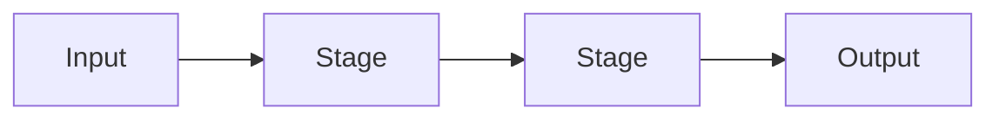

# Week [NN] — [Topic]

> [One sentence: what I built and the core idea behind it.]

<!--
Post-exercise technical recap, not a build guide: what I implemented, how it
works, and what I learned by experimenting.
- Prefer diagrams, tables, small snippets and screenshots over prose.
- Delete placeholders and optional blocks that don't apply.
- Images live in docs/images/weekNN/ → 
-->

---

## Why It Matters

<!-- 2–4 bullets: what this lets a procedural world do, and where it sits in the larger pipeline. -->

- [What it lets me create, simulate, or control]
- [Where it fits: terrain → simulation → structures → persistence → …]

---

## Core Concepts

<!-- Only the terms needed to read the rest of this doc. One line each, in this project's terms. -->

| Concept | Meaning |
|---|---|
| **[Concept]** | [Short definition] |
| **[Concept]** | [Short definition] |

---

## How It Works

<!-- The mechanism, independent of code. Lead with one diagram; add equations or tables only where they carry something the diagram can't. -->



[1–3 sentences walking through the diagram: what passes between stages and what each stage decides.]

<!-- Optional, keep only what helps:
- Key relationship as an equation, e.g. $h = \frac{\sum_i w_i a_i n_i}{\sum_i w_i}$
- Comparison table (method A vs B, op vs effect)
- stateDiagram / sequenceDiagram for loops, time steps, or async flows
-->

---

## Implementation

<!-- How this project realises the mechanism above. Map code to the stages in the diagram. -->

### Key Files

| File | Role |
|---|---|
| `app/src/[path]` | [Pipeline stage / responsibility] |
| `app/src/[path]` | [Pipeline stage / responsibility] |

### Key Logic

<!-- The 1–3 pieces of logic that define the behaviour. For each: what it does and why it's written this way. Snippet only if it clarifies — the core lines, not the whole function (~15 lines max). -->

**`[functionOrType]`** — [what it does and why it matters]

```ts
// Minimal excerpt showing the essential logic
```

### Parameters / Controls

<!-- UI controls and key constants. "Effect" = what visibly changes. -->

| Parameter | Default / Range | Effect |
|---|---|---|
| `[name]` | [value] | [What visibly changes] |

---

## Experiments & Observations

<!-- What I actually tried while building: comparisons, failures, surprises, limitations. One row each; expand notable ones below with a screenshot or GIF. -->

| Tried | Expected | Observed | Why / Next |
|---|---|---|---|
| [Change or comparison] | [What I thought would happen] | [What happened] | [Explanation or follow-up] |

### [Notable observation]


[1–2 sentences: what this shows and what it revealed.]

<!-- Before/after pairs:
| Before | After |
|---|---|
|  |  |
-->

---

## Takeaways

<!-- Short bullets. Skip any line with nothing real to say. -->

- **Now I understand:** [...]
- **Surprised by:** [...]
- **Limitations:** [What the current version can't do, or only approximates]
- **Next:** [Possible extensions or open questions]

---

## References

### Course

- [Lecture / week material] — [what it covered]

### External

- [Title](https://example.com) — [what it was useful for]
