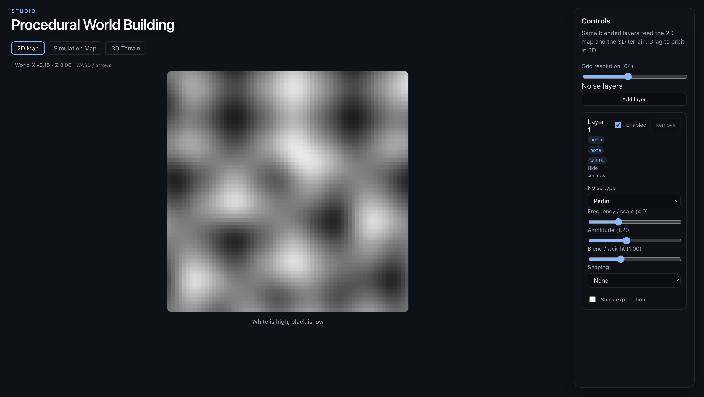
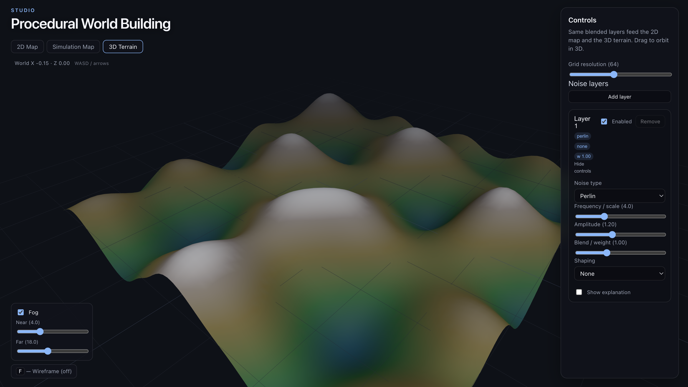
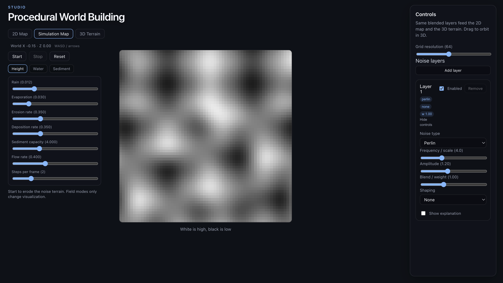

# Procedural Noise and Terrain

## Why This Matters

This exercise is the bridge between a flat practice mesh and a real terrain
system. Instead of sculpting hills by hand, we let math generate a field of
elevation values and use those values in two ways:

1. as a **2D grayscale map** you can read like an image
2. as **3D height** that pushes terrain vertices up and down

That is the core pattern behind a lot of procedural world building. Once you
can generate, shape, and combine height values, you have the foundation for
mountains, plains, cliffs, islands, and eventually biomes or planets.

In this repo, the exercise is intentionally visual and interactive:

- a **2D Map** tab shows the current heightmap as grayscale
- a **3D Terrain** tab applies that same data to a subdivided plane
- a **layer system** lets you mix multiple kinds of noise together

---

## Key Concepts

**Procedural noise**  
A function that turns coordinates into values that *look natural*. The result
is not truly random static. Nearby points usually have related values, which is
why noise makes believable terrain instead of TV snow.

**Heightmap**  
A 2D grid of numbers. Each number means “how high is this point?” In the 2D
view, that becomes grayscale. In the 3D view, that becomes vertex height.



*The 2D Map tab: bright regions are high, dark regions are low — the height field as an image.*

**Layer**  
One pass of noise with its own settings: noise type, frequency, amplitude,
shaping, enabled/disabled state, and blend weight.

**Shaping**  
Math that transforms the raw noise after sampling it. Shaping does not invent a
new noise function; it changes the character of the values you already have.

**Resolution**  
How many samples are taken across the map. Higher resolution means a denser
heightmap and more vertices in the terrain plane.

---

## How It Works

The implementation in this repo follows this pipeline:

```text
[ x, y coordinates ]
        |
        v
[ sample each noise layer ]
        |
        v
[ apply shaping per layer ]
        |
        v
[ scale by layer amplitude ]
        |
        v
[ blend layers by weight ]
        |
        v
[ final heightmap ]
      /   \
     /     \
    v       v
[ 2D map ] [ 3D terrain ]
```

### Stage 1: Coordinates

The system starts with 2D sample coordinates across a square grid. For each
cell, the code samples one or more noise functions.

Conceptually:

```text
top-left -----------------> x
   |
   |
   v
   y
```

Every sample point asks the same question:

```text
What height value lives at this coordinate?
```

### Stage 2: Noise

Each layer chooses a base noise function, such as Perlin or Cellular/Worley.
That function returns a value roughly in the range `[-1, 1]`.

Very loosely:

```text
n = noise(x, y)
```

### Stage 3: Shaping

The raw value can be transformed to produce a different visual style:

- smoother rolling hills
- sharp ridges
- stepped terraces
- warped patterns

This happens **per layer**, after sampling and before blending.

### Stage 4: Heightmap

After all active layers are sampled and shaped, the results are combined into
one final heightmap.

In this implementation:

- each layer can be **enabled or disabled**
- each layer has an **amplitude**
- each layer has a **weight**
- the weighted layer values are averaged into a single final map

### Stage 5: 2D Map and 3D Terrain

The same final heightmap is used in both tabs:

- **2D Map**: values are drawn as grayscale pixels
- **3D Terrain**: values are applied to the subdivided plane’s vertices

That shared data is the important idea: the 2D image is not a separate effect.
It is a readable preview of the same numbers that drive the terrain.

---

## 2D Map vs 3D Terrain

The two views are different windows into the same data.

| View | What you see | What it helps you understand |
|---|---|---|
| **2D Map** | Bright and dark regions | The pattern of the height values |
| **3D Terrain** | Hills, valleys, ridges, terraces | How those values feel as landforms |

A useful mental model:

- **white** = high
- **black** = low
- **gray** = somewhere in between

If a bright blob appears in the 2D map, you should expect a raised area in the
3D terrain. If you see thin bands or cracked cells in 2D, those same structures
should show up in 3D as stepped or broken-looking terrain features.



*3D Terrain: the height field becomes vertex displacement, with elevation coloring and fog as rendering on top.*

---

## Noise Types

This exercise includes four noise families. Each one answers the same question
("what value is at this coordinate?") in a different visual style.

| Noise type | Intuitive behavior | Typical look |
|---|---|---|
| **Perlin** | Smooth gradient noise | Soft hills and natural rolling terrain |
| **Simplex** | Similar to Perlin, on a different underlying structure | Smooth, organic detail with fewer visible grid artifacts |
| **Value** | Interpolates random values stored on a grid | Blobby, patchy, a little more synthetic |
| **Cellular / Worley** | Measures distance to nearby feature points | Cells, cracks, honeycomb-like regions |

### Perlin

Perlin noise is the classic terrain choice. It tends to produce smooth,
continuous variation, which is why it reads well as hills and valleys.

Simple form:

```text
n = Perlin(x, y)
```

Visual feel:

- broad rolling forms
- gentle transitions
- easy to read in both 2D and 3D

### Simplex

Simplex is closely related to Perlin but often feels a little cleaner or less
grid-like. It is good when you want organic detail without obvious square-cell
patterns.

```text
n = Simplex(x, y)
```

Visual feel:

- smooth and natural
- slightly different texture from Perlin
- useful as a second layer to break up repetition

### Value

Value noise starts from random values on lattice points and blends between
them. It is still smooth, but usually looks more patchy or “chunky” than
gradient-based noise.

```text
n = lerp(fade(hash), ...)
```

Visual feel:

- cloudy or blotchy
- easy to understand
- good for demonstrating the difference between noise families

### Cellular / Worley

Cellular noise measures the distance to the nearest random feature point. That
makes it feel very different from the others.

```text
n = remap(min distance to feature point)
```

Visual feel:

- cell boundaries
- crackle-like patterns
- good for plate-like regions, broken ground, or unusual terrain masks

---

## Parameters

The controls in the app separate **global sampling** from **per-layer style**.

### Resolution

Resolution is shared by the whole exercise.

| Lower resolution | Higher resolution |
|---|---|
| Fewer samples | More samples |
| Blockier 2D map | Sharper 2D map |
| Coarser terrain mesh | Smoother terrain mesh |
| Faster | More expensive |

You can think of it as:

```text
resolution = how many measurement points we take
```

### Frequency / scale

Frequency controls how quickly the noise changes across space.

| Lower frequency | Higher frequency |
|---|---|
| Bigger landforms | Smaller repeated features |
| Broad hills | Finer texture |
| More zoomed out | More zoomed in |

Conceptually:

```text
sample at (x * frequency, y * frequency)
```

### Amplitude / height

Amplitude scales how strongly one layer affects the final terrain height.

| Lower amplitude | Higher amplitude |
|---|---|
| Subtle contribution | Strong contribution |
| Gentle height changes | Taller hills / deeper valleys |

Simple idea:

```text
layerValue = shapedNoise * amplitude
```

### Weight

Weight controls how strongly a layer contributes to the final blend compared to
the other layers.

| Lower weight | Higher weight |
|---|---|
| Layer matters less | Layer dominates more |
| Good for subtle detail | Good for primary structure |

Simple idea:

```text
final = weighted average of active layers
```

Weight is not the same as amplitude:

- **amplitude** changes the size of the layer’s height values
- **weight** changes how much that layer counts in the final mix

---

## Shaping Operations

Shaping transforms the raw noise value after sampling.

Start with:

```text
n = noise(x, y)
```

Then reshape it into a different kind of terrain signal.

| Shaping | What it does | Typical use |
|---|---|---|
| **None** | Keeps raw noise | Baseline terrain |
| **Ridged** | Turns valleys into sharp crests | Mountain chains |
| **Billow** | Folds negative values upward | Puffy rolling hills |
| **Turbulence** | Adds absolute multi-scale roughness | Crumpled chaotic detail |
| **Terracing** | Quantizes heights into bands | Step-like topography |
| **Power Curve** | Pushes values toward peaks or midtones | Sharpening or softening contrast |
| **Domain Warping** | Distorts sample coordinates | Twisted, swirled forms |

### None

Use the sampled value directly.

```text
h = n(x, y)
```

### Ridged

Take the absolute value, invert it, then square it so the crests feel sharper.

```text
h = (1 - |n|)^2 * 2 - 1
```

Visual feel:

- narrow crests
- valley-to-ridge conversion
- mountain-like structure

### Billow

Fold negative values upward so both halves of the wave become rounded hills.

```text
h = |n| * 2 - 1
```

Visual feel:

- soft puffy forms
- fewer deep cuts
- rounded repeated mounds

### Turbulence

Sum several absolute-noise samples at increasing frequency and decreasing
strength.

```text
h = sum( |n(x * 2^i, y * 2^i)| * 0.5^i )
```

In this exercise, the extra parameter is **octaves**:

- fewer octaves = simpler pattern
- more octaves = busier, rougher pattern

### Terracing

Snap the height into discrete bands.

```text
h = floor(((n + 1) / 2) * steps) / steps * 2 - 1
```

The extra parameter is **steps**:

- fewer steps = chunkier large terraces
- more steps = thinner terrace bands

### Power Curve

Raise the magnitude of the value to a power while keeping the sign.

```text
h = sign(n) * |n|^p
```

The extra parameter is **exponent**:

- `p > 1` sharpens peaks and reduces mid-level values
- `0 < p < 1` fills in the middle and feels softer

### Domain Warping

Use noise to bend the sample coordinates before sampling again.

```text
h = n(x + s * n(x, y), y + s * n(x + 5.2, y + 1.3))
```

The extra parameter is **warp strength**:

- lower = slight bending
- higher = stronger twisting and distortion

Domain warping is useful when the base pattern feels too regular and you want
it to look less obviously generated from a clean grid.

---

## The Layer System

One of the biggest ideas in this exercise is that terrain usually becomes more
interesting when it is built from **multiple simple layers** instead of one
complicated formula.

Each layer in this implementation has:

- its own **noise type**
- its own **frequency**
- its own **amplitude**
- its own **shaping**
- an optional **shaping parameter**
- an **enabled / disabled** switch
- a **weight**

### Why layers matter

Different layers can play different roles:

- one low-frequency layer for the broad shape
- one medium-frequency layer for hills
- one high-frequency layer for surface variation
- one cellular layer for cracks or broken regions

That gives you a useful visual stack:

```text
macro form
  + medium detail
  + small detail
  + optional special pattern
  = final terrain
```

### Blending in this exercise

The app samples all enabled layers, then blends them into one final result.

Conceptually:

```text
finalHeight = weighted average of enabled layer values
```

A layer with:

- **high amplitude** produces stronger height values
- **high weight** contributes more strongly to the blend
- **disabled** contributes nothing

This keeps the system easy to reason about:

- amplitude changes the *shape intensity* of the layer
- weight changes the *importance* of the layer relative to others

### A simple example

Imagine three layers:

| Layer | Role |
|---|---|
| Perlin, low frequency | Large continents / broad hills |
| Simplex, medium frequency | Secondary terrain variation |
| Cellular, low weight | Subtle cracking or breakup |

The final terrain is not “one noise type.” It is the conversation between those
layers.

---

## Hydraulic Erosion (Simulation)

Noise generates the **initial** height field. Hydraulic erosion is a separate
**simulation** that changes that field over time: rain adds water, water flows
downhill, steep flow erodes and carries sediment, flatter areas deposit it, and
water evaporates. The Simulation Map can show height, water, or sediment so you
can inspect those buffers while the process runs.



*Simulation Map: Start / Stop / Reset and field modes (Height / Water / Sediment) for the live erosion buffers.*

---

## What This Exercise Teaches

This exercise is not just about making a bumpy plane. It teaches a reusable
workflow:

1. sample coordinates across a grid
2. turn coordinates into noise values
3. shape those values into a desired terrain style
4. combine multiple layers
5. reuse the same heightmap in both 2D and 3D

That workflow scales well. Today it drives a grayscale map and a flat terrain
plane. Later, the same ideas can drive:

- sphere displacement
- biome masks
- coastlines
- erosion-style post-processing
- shader-based coloring

---

## Key Takeaways

- Procedural noise turns coordinates into terrain-like values.
- A **heightmap** is the shared data structure between 2D preview and 3D terrain.
- Different noise types have different visual personalities.
- Frequency, amplitude, resolution, and weight each control a different aspect
  of the result.
- Shaping operations are often just as important as the base noise itself.
- Rich terrain usually comes from **layering simple signals**, not from one
  perfect formula.

---

## Try It

1. Start with one Perlin layer and `None` shaping.
2. Switch between **2D Map** and **3D Terrain** and notice that the same
   structure appears in both views.
3. Increase frequency and watch large hills break into smaller detail.
4. Try **Ridged** and **Billow** on the same base noise and compare the landform
   personality.
5. Add a second layer with a different noise type and a lower weight.
6. Disable and re-enable that layer to see exactly what it contributes.
7. Try **Terracing** or **Domain Warping** to see how much shaping can change
   the same underlying noise.

<!-- Record observations or screenshots here after class. -->

---

## What I Learned

<!-- Write this yourself after completing the exercise. What looked natural? What felt too artificial? Which noise type or shaping operation surprised you? -->

---

## References

**This repository**
- `docs/tutorials/03-procedural-topography-maps-shaders.md`
- `app/src/noise/types.ts`
- `app/src/noise/generateHeightmap.ts`
- `app/src/noise/explanations.ts`
- `app/src/ui/AppChrome.tsx`
- `app/src/ui/NoiseMapPreview.tsx`
- `app/src/scene/exercises/NoiseExercise.tsx`

**External**
- [The Book of Shaders - Noise](https://thebookofshaders.com/11/)
- [The Book of Shaders - fBM](https://thebookofshaders.com/13/)
- [Red Blob Games - Noise Functions and Map Generation](https://www.redblobgames.com/maps/terrain-from-noise/)
